# Class Diagram — Federated Simulated World

**Last updated: 2026-06-14**

Render with any Mermaid-compatible viewer (GitHub, VS Code Mermaid Preview, mermaid.live).

Three diagrams are provided:
- **A** — Simulation core (world engine, config hierarchy, agents, disease model, data sources, LLM layer)
- **B** — Federated learning layer (FLSilo, FLLearner, aggregation, end conditions)
- **C** — Visualisation & reporting layer

---

## Diagram A — Simulation Core

```mermaid
classDiagram
    direction TB

    %% ── Configuration Hierarchy ──────────────────────────────────────────────
    class WorldConfig {
        +agents : AgentConfig
        +epidemic : EpidemicConfig
        +seed_offset : int
        +reveal_incubating_icd : bool
    }

    class AgentConfig {
        +num_agents : int
        +data_source : DataSource
        Note: injected at construction; swap for Ollama/MIMIC
        +background_visit_rate : float
    }

    class EpidemicConfig {
        +progressions : list[str]
        +disease_strategy : str
        +disease_weights : list[float]
        Note: None = uniform; Dirichlet-sampled per silo
        +beta_scale : float
        +initial_seeds : int
        +contact_rate_sigma : float
        +static_mode : bool
        +infectious_fraction : float
        +cases_per_day : int
    }

    WorldConfig *-- AgentConfig
    WorldConfig *-- EpidemicConfig

    %% ── DataSource Strategy ──────────────────────────────────────────────────
    class DataSource {
        <<abstract>>
        +opening_statement(inner_state, days, personality) str
    }

    class TemplateDataSource {
        +confusion_rate : float
        Note: fraction of visits with swapped disease text; label stays correct
        -_narrator : SymptomNarrator
        +opening_statement(inner_state, days, personality) str
    }

    class PhraseLibraryDataSource {
        +confusion_rate : float
        -_lib : PhraseLibrary
        Note: 675 phrases × disease × severity × personality
        +opening_statement(inner_state, days, personality) str
    }

    class OllamaDataSource {
        -_client : PatientLLMClient
        -_fallback : TemplateDataSource
        Note: falls back to template on LLM failure
        +opening_statement(inner_state, days, personality) str
    }

    DataSource <|-- TemplateDataSource
    DataSource <|-- PhraseLibraryDataSource
    DataSource <|-- OllamaDataSource
    AgentConfig --> DataSource

    %% ── World Engine ─────────────────────────────────────────────────────────
    class WorldEngine {
        -_config : WorldConfig
        +agents : list[Agent]
        +locations : dict[str, Location]
        +sir_model : SIRModel
        +clinic_queue : ClinicQueue
        +strategy : DiseaseStrategy
        +progressions : list[DiseaseProgressionStrategy]
        +current_day : int
        +event_log : list[str]
        +epidemic_active : bool
        Note: True while sir_model.I > 0
        +is_done : bool
        Note: non-FL shim — checks optional _end_condition or epidemic_active
        +stop_reason : str
        +step_tick()
        +run_sim_days(n) list[DiagnosticEvent]
        Note: primary interface for FLSilo; dispatches to SIR or static
        +set_patient_llm(client)
        Note: shim — replaces data_source with OllamaDataSource(client)
        +register_diagnostic_fn(fn)
        +attach_interaction_logger(logger)
        -_generate_opening(agent, event) str
        Note: delegates to config.agents.data_source
        -_run_sir_days(n) list
        -_run_static_days(n) list
    }

    WorldEngine --> WorldConfig

    %% ── Agent ────────────────────────────────────────────────────────────────
    class Agent {
        +id : str
        +name : str
        +health_state : HealthState
        +personality : Personality
        +severity_threshold : float
        +hospitalised : bool
        +inner_state : InnerState
        +should_seek_care() bool
        +followup_answer(question) str
        +build_diagnostic_event() DiagnosticEvent
        +apply_daily_infection(progression, disease_weights) bool
        Note: uses rng.choices() with Dirichlet weights
    }

    class HealthState {
        +status : HealthStatus
        +severity : float
        +symptoms : float
        +days_infected : int
        +infect(trajectory)
        +step()
        +apply_treatment(decay_boost)
        +sir_compartment : str
    }

    class InnerState {
        +severity : float
        +symptoms : float
        +days_infected : int
        +disease_name : str
        +trend : str
        +fatigue : float
        +pain : float
        +mood : float
        +top_vital : tuple
    }

    WorldEngine "1" *-- "N" Agent
    WorldEngine "1" *-- "1" SIRModel
    WorldEngine "1" *-- "1" ClinicQueue
    WorldEngine --> DiseaseStrategy
    WorldEngine "1" --> "1..*" DiseaseProgressionStrategy

    Agent "1" *-- "1" HealthState
    Agent "1" ..> "1" InnerState : computes

    %% ── Disease Trajectory ───────────────────────────────────────────────────
    class DiseaseTrajectory {
        +peak_severity : float
        +rise_days : float
        +decay_rate : float
        +disease_name : str
        +icd_code : str
        +incubation_days : int
        +vital_slopes : dict
        +trend : str
        +cleared : bool
        +step() tuple[float,float]
    }

    HealthState --> DiseaseTrajectory

    %% ── Non-Infectious Complaints ────────────────────────────────────────────
    class NonInfectiousComplaint {
        <<dataclass, frozen>>
        +name : str
        +icd_code : str
        +disease : str
        +management : str
        +prompt_context : str
    }

    WorldEngine ..> NonInfectiousComplaint : samples randomly

    %% ── LLM Layer ────────────────────────────────────────────────────────────
    class PatientLLMClient {
        +model : str
        Note: phi3:mini — frozen, never fine-tuned
        +opening_statement(severity, days, personality) str
        +complaint_opening(prompt_context, personality) str
        +followup_answer(question, severity, personality, case_table, day) str
        +health_check() bool
    }

    class OllamaDiagnosticClient {
        +model : str
        +disease_glossary : list[str]
        Note: fictional disease names; None = standard mode
        +explicit_exclusion : bool
        +diagnose(event, _queue, _proto_lib) DiagnosticEvent
        +update_examples(round_events)
        Note: federated few-shot bank
        +update_global_stereotypes(state, n_silos)
        +health_check() bool
    }

    OllamaDataSource --> PatientLLMClient
    WorldEngine ..> OllamaDiagnosticClient : via register_diagnostic_fn()

    %% ── Symptom Narration ────────────────────────────────────────────────────
    class SymptomNarrator {
        +full_opening_statement(inner_state, days, personality) str
        +followup_answer(symptoms, personality, question, case_table, day) str
    }

    class Personality {
        <<enumeration>>
        STOIC
        NEUTRAL
        ANXIOUS
    }

    TemplateDataSource --> SymptomNarrator
    SymptomNarrator ..> Personality
    Agent ..> Personality

    %% ── Diagnostic Pipeline ──────────────────────────────────────────────────
    class DiagnosticEvent {
        +agent_id : str
        +severity : float
        +symptoms : float
        +days_infected : int
        +ground_truth : str
        Note: ICD-code label for FL classifier
        +gt_disease : str
        +gt_severity : str
        +conversation : list
        +case_table : CaseTable
        +action : DiagnosticAction
        +is_background : bool
        +opening : str
        +num_turns : int
    }

    class ClinicQueue {
        +patients : deque
        +processed : list
        +enqueue(event)
        +process_all(diagnostic_fn) list
        +apply_outcomes(results, agents, hospital_id) list
    }

    class SIRModel {
        +S : int
        +I : int
        +R : int
        +beta : float
        +gamma : float
        +history : list
        +step(agents)
    }

    ClinicQueue "1" o-- "N" DiagnosticEvent

    %% ── Disease Strategies ───────────────────────────────────────────────────
    class DiseaseStrategy {
        <<abstract>>
        +name : str
        +transmission_rate(location_type) float
    }
    class StandardFluStrategy
    class MildCoronaStrategy
    class SlowBurnStrategy

    class DiseaseProgressionStrategy {
        <<abstract>>
        +name : str
        +icd_code : str
        +sample_trajectory(rng) DiseaseTrajectory
    }
    class InfluenzaProgression { icd_code = J11.1 }
    class BacterialPneumoniaProgression { icd_code = J18.9 }
    class SlowBurnProgression { icd_code = A41.9 }

    DiseaseStrategy <|-- StandardFluStrategy
    DiseaseStrategy <|-- MildCoronaStrategy
    DiseaseStrategy <|-- SlowBurnStrategy
    DiseaseProgressionStrategy <|-- InfluenzaProgression
    DiseaseProgressionStrategy <|-- BacterialPneumoniaProgression
    DiseaseProgressionStrategy <|-- SlowBurnProgression
```

---

## Diagram B — Federated Learning Layer

```mermaid
classDiagram
    direction TB

    %% ── End Conditions ───────────────────────────────────────────────────────
    class EndCondition {
        <<abstract>>
        +reason : str
        +check(world) bool
        +reset()
    }
    class HorizonCondition { +max_days : int }
    class ExtinctionCondition { +consecutive_days : int }
    class NoSusceptiblesCondition
    class TrainingBudgetCondition { +target_events : int }
    class AnyCondition { +conditions : list[EndCondition] }

    EndCondition <|-- HorizonCondition
    EndCondition <|-- ExtinctionCondition
    EndCondition <|-- NoSusceptiblesCondition
    EndCondition <|-- TrainingBudgetCondition
    EndCondition <|-- AnyCondition
    AnyCondition o-- EndCondition

    %% ── FLSilo (FL participant) ──────────────────────────────────────────────
    class FLSilo {
        +world : WorldEngine
        +learner : FLLearner
        Note: doctor — disease + severity classifier
        +nurse_learner : FLLearner
        Note: triage nurse — severity-only classifier
        +sim_days : int
        +min_events_to_train : int
        +is_done : bool
        +stop_reason : str
        +last_round_events : list[DiagnosticEvent]
        +run_round(round_num) dict
        Note: advance sim → prequential eval → train → holdout eval → end check
        +get_weights() list[ndarray]
        +set_weights(weights)
        +get_nurse_weights() list[ndarray]
        +set_nurse_weights(weights)
        +release_model()
        Note: frees VRAM for both learners; peak = 1 silo at a time
        +try_accept_global(weights) bool
        +set_patient_llm(client)
        Note: replaces world DataSource with OllamaDataSource
        +register_diagnostic_fn(fn)
        +clinic_queue
        +sir_model
    }

    FLSilo --> WorldEngine
    FLSilo --> FLLearner
    FLSilo --> EndCondition

    %% ── FLLearner ────────────────────────────────────────────────────────────
    class FLLearner {
        +label_space : str
        Note: disease / severity / fictional_disease
        +lora_config : LoRAConfig
        +dataset : SiloDataset
        +train_sample_cap : int
        +device : str
        +model
        Note: lazy-built DistilBERT+LoRA
        +local_model
        Note: shadow model never receiving global weights
        +train(events, round_num) tuple[int, list[float]]
        +train_local(events, round_num)
        +evaluate(events) dict
        +evaluate_local(events) dict
        +evaluate_holdout() dict
        +get_weights() list[ndarray]
        +set_weights(weights)
        +release()
        +try_accept_global(weights) bool
        +snapshot_for_freeze(events)
    }

    %% ── SiloDataset ──────────────────────────────────────────────────────────
    class SiloDataset {
        +silo_id : int
        +holdout_fraction : float
        +append(events)
        +load_train() list
        +load_holdout() list
        +sample_train(n) list
        +size() tuple[int, int]
    }

    FLLearner --> SiloDataset

    %% ── Config ───────────────────────────────────────────────────────────────
    class FLTrainConfig {
        +num_silos : int
        +max_rounds : int
        Note: simulation-guided; safety cap
        +sim_days : int
        +local_epochs : int
        +lr : float
        +lora_rank : int
        +dirichlet_alpha : float
        Note: 0.3 default; controls non-IID degree
        +world_configs : list[WorldConfig]
        Note: flat per-silo override (from fl/train.py); None = global params
        +doctor_label_space : str
        Note: disease / fictional_disease
        +disease_glossary : list[str]
        Note: fictional disease names; None = standard mode
        +explicit_real_disease_exclusion : bool
        +use_ollama : bool
        +fedavg_min_examples : int
        +lora_config() LoRAConfig
    }

    %% ── Label Space ──────────────────────────────────────────────────────────
    class DISEASE_LABELS {
        <<fl/learner.py constant>>
        non-infectious / influenza / pneumonia / unknown
        Note: 4 standard disease classes
        severity: discharge / mild / moderate / severe / critical
        Note: fictional_disease maps influenza→velarex, pneumonia→sornathis
    }

    class LoRAConfig {
        +model_name_or_path : str
        Note: distilbert-base-uncased
        +rank : int
        +lora_alpha : float
        +lora_dropout : float
        +target_modules : list[str]
        Note: q_lin, v_lin
        +num_labels : int
    }

    %% ── Centralized Baseline ─────────────────────────────────────────────────
    class CentralizedTrainer {
        +silos : list[WorldEngine]
        Note: bare worlds; models managed by trainer
        +sim_days : int
        +_pool_buffer : list
        Note: all events from all silos pooled
        +run_round() CentralizedRoundMetrics
        +get_weights() list[ndarray]
        +release_model()
    }

    %% ── Factory Helpers (fl/train.py module level) ───────────────────────────
    class FactoryHelpers {
        <<fl/train.py>>
        _build_sim_world_config(silo_idx, wc, cfg, rng) SimWorldConfig
        Note: flat WorldConfig → simulation.world_config.WorldConfig
        _build_fl_silo(silo_idx, wc, cfg, rng, dataset) FLSilo
        Note: FLSilo = world + doctor + nurse + end_condition
        _build_bare_world(silo_idx, wc, cfg, rng) WorldEngine
        Note: no learners; for static/centralized modes
    }

    %% ── Aggregation ──────────────────────────────────────────────────────────
    class FedAvg {
        <<utility>>
        _fedavg(weights_list, n_examples) list[ndarray]
        Note: weighted mean of LoRA adapter arrays
    }

    %% ── Prototype / Stereotype Libraries ────────────────────────────────────
    class PrototypeLibrary {
        +silo_id : int
        +add_from_events(events, enc_model, tokenizer, round_num) int
        +size() int
        +merge(global_protos)
    }

    class StereotypeLibrary {
        +update_from_events(events, enc_model, tokenizer)
        +get_state() dict
        +set_global(global_state)
    }

    FLSilo ..> PrototypeLibrary : used by OllamaDiagnosticClient
    FLSilo ..> StereotypeLibrary : federated via train.py

    %% ── Flower / W&B ─────────────────────────────────────────────────────────
    class WandBFedAvg {
        +wandb_run : Run
        +aggregate_fit(round, results, failures)
    }
```

---

## Key Design Patterns

| Pattern | Where used |
|---|---|
| **Strategy** | `DataSource` ABC — swap TemplateDataSource / PhraseLibraryDataSource / OllamaDataSource / MIMICDataSource at config time |
| **Strategy** | `DiseaseStrategy`, `DiseaseProgressionStrategy` — swap disease behaviour at runtime |
| **Composition** | `WorldConfig(agents: AgentConfig, epidemic: EpidemicConfig)` — agents compose world, not implement it |
| **Template Method** | `DiseaseProgressionStrategy.sample_trajectory()` → `_sample()` helper |
| **Observer** | `SIRModel.step(agents)` — recomputes S/I/R from agent states each day |
| **Factory** | `end_conditions.from_config(name, param)` — builds EndCondition from string |
| **Factory** | `_build_fl_silo()`, `_build_bare_world()` — module-level helpers in `fl/train.py` replace per-function `_make_world()` closures |
| **Adapter** | `MimicDiseaseTrajectory` — adapts `MimicRecord` to `DiseaseTrajectory` interface |
| **Decorator** | `WandBFedAvg` — extends `FedAvg` with W&B callbacks |
| **Object Pool** | `FLSilo.release_model()` + lazy rebuild — VRAM scheduling; peak = 1 model at a time |
| **Registry** | `PROGRESSION_STRATEGIES`, `NON_INFECTIOUS_COMPLAINTS` — lookup by name |
