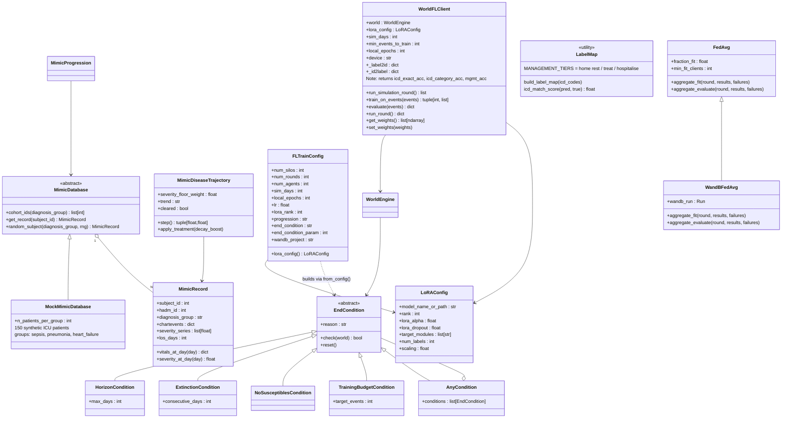

# Class Diagram — Federated Simulated World

**Last updated: 2026-05-29**

Render with any Mermaid-compatible viewer (GitHub, VS Code Mermaid Preview, mermaid.live).

Two diagrams are provided:
- **A** — Simulation core (world engine, agents, disease model, symptom layer)
- **B** — Federated learning layer (FL client, aggregation, MIMIC, end conditions)

---

## Diagram A — Simulation Core

```mermaid
classDiagram
    direction TB

    %% ── World Engine ─────────────────────────────────────────────────────────
    class WorldEngine {
        +agents : list[Agent]
        +locations : dict[str, Location]
        +sir_model : SIRModel
        +clinic_queue : ClinicQueue
        +strategy : DiseaseStrategy
        +progression : DiseaseProgressionStrategy
        +end_condition : EndCondition
        +current_day : int
        +is_done : bool
        +stop_reason : str
        +step_tick()
        +inject_disease_cloud(location_id, intensity)
        +set_disease_strategy(strategy)
        +set_progression_strategy(strategy)
        +collect_end_of_day_cases() list
        +run_fl_round()
    }

    %% ── Agent ────────────────────────────────────────────────────────────────
    class Agent {
        +id : str
        +name : str
        +health_state : HealthState
        +personality : Personality
        +severity_threshold : float
        +hospitalised : bool
        +inner_state : InnerState
        +should_seek_care() bool
        +opening_statement() str
        +followup_answer(question) str
        +build_diagnostic_event() DiagnosticEvent
        +apply_daily_infection(progression) bool
    }

    class HealthState {
        +status : HealthStatus
        +severity : float
        +symptoms : float
        +days_infected : int
        +infect(trajectory)
        +step()
        +apply_treatment(decay_boost)
        +sir_compartment : str
    }

    class InnerState {
        +severity : float
        +symptoms : float
        +days_infected : int
        +trend : str
        +fatigue : float
        +pain : float
        +mood : float
        +top_vital : tuple
    }

    %% ── Disease Trajectory ───────────────────────────────────────────────────
    class DiseaseTrajectory {
        +peak_severity : float
        +rise_days : float
        +decay_rate : float
        +symptom_sensitivity : float
        +severity_floor_weight : float
        +disease_name : str
        +icd_code : str
        +trend : str
        +cleared : bool
        +step() tuple[float,float]
        +apply_treatment(decay_boost)
    }

    %% ── Case Table ───────────────────────────────────────────────────────────
    class CaseTable {
        +variables : list[str]
        +get(variable, day) float
        +band(variable, day) str
    }
    class MimicCaseTable {
        +_load_from_record(record) dict
    }

    %% ── Symptom Narration ────────────────────────────────────────────────────
    class SymptomNarrator {
        +opening_statement(symptoms, days, personality) str
        +full_opening_statement(inner_state, days, personality) str
        +report_variable(variable, value, band, personality) str
        +followup_answer(symptoms, personality, question, case_table, day) str
    }

    class Personality {
        <<enumeration>>
        STOIC
        NEUTRAL
        ANXIOUS
    }

    %% ── Diagnostic Pipeline ──────────────────────────────────────────────────
    class DiagnosticEvent {
        +agent_id : str
        +severity : float
        +symptoms : float
        +days_infected : int
        +ground_truth : str
        Note: format = ICD-code / management-tier
        e.g. J10.89 / treat
        +conversation : list
        +case_table : CaseTable
        +action : DiagnosticAction
        +oracle_label : str
        +diagnosis : str
    }

    class ClinicQueue {
        +patients : deque
        +processed : list
        +enqueue(event)
        +process_all(diagnostic_fn) list
        +apply_outcomes(results, agents, hospital_id) list
    }

    class SIRModel {
        +S : int
        +I : int
        +R : int
        +beta : float
        +gamma : float
        +history : list
        +step(agents)
    }

    %% ── Disease Strategies ───────────────────────────────────────────────────
    class DiseaseStrategy {
        <<abstract>>
        +name : str
        +description : str
        +transmission_rate(location_type) float
        +cloud_decay_rate() float
    }
    class StandardFluStrategy
    class AggressiveFluStrategy
    class MildCoronaStrategy
    class SlowBurnStrategy

    class DiseaseProgressionStrategy {
        <<abstract>>
        +name : str
        +icd_code : str
        +sample_trajectory(rng) DiseaseTrajectory
    }
    class StandardFluProgression {
        icd_code = J11.1
    }
    class AggressiveFluProgression {
        icd_code = J09.X1
    }
    class PersistentFluProgression {
        icd_code = J10.89
    }
    class MildCoronaProgression {
        icd_code = U07.2
    }
    class SlowBurnProgression {
        icd_code = A41.9
    }
    class DeadlyProgression {
        icd_code = J18.9
    }
    class MimicProgression {
        icd_code per diagnosis_group
    }

    %% ── Relationships ────────────────────────────────────────────────────────
    WorldEngine "1" *-- "N" Agent
    WorldEngine "1" *-- "1" SIRModel
    WorldEngine "1" *-- "1" ClinicQueue
    WorldEngine --> DiseaseStrategy
    WorldEngine --> DiseaseProgressionStrategy

    Agent "1" *-- "1" HealthState
    Agent "1" ..> "1" InnerState : computes
    Agent "1" *-- "1" CaseTable
    Agent "1" *-- "1" SymptomNarrator

    HealthState --> DiseaseTrajectory

    ClinicQueue "1" o-- "N" DiagnosticEvent

    CaseTable <|-- MimicCaseTable

    DiseaseStrategy <|-- StandardFluStrategy
    DiseaseStrategy <|-- AggressiveFluStrategy
    DiseaseStrategy <|-- MildCoronaStrategy
    DiseaseStrategy <|-- SlowBurnStrategy

    DiseaseProgressionStrategy <|-- StandardFluProgression
    DiseaseProgressionStrategy <|-- AggressiveFluProgression
    DiseaseProgressionStrategy <|-- MildCoronaProgression
    DiseaseProgressionStrategy <|-- SlowBurnProgression
    DiseaseProgressionStrategy <|-- DeadlyProgression
    DiseaseProgressionStrategy <|-- MimicProgression

    SymptomNarrator ..> Personality
    Agent ..> Personality
    DiagnosticEvent --> CaseTable
```

---

## Diagram B — Federated Learning Layer

---

## Key Design Patterns

| Pattern | Where used |
|---|---|
| **Strategy** | `DiseaseStrategy`, `DiseaseProgressionStrategy` — swap disease behaviour at runtime |
| **Template Method** | `DiseaseProgressionStrategy.sample_trajectory()` → `_sample()` helper |
| **Observer** | `SIRModel.step(agents)` — recomputes S/I/R from agent states each day |
| **Factory** | `end_conditions.from_config(name, param)` — builds EndCondition from string |
| **Adapter** | `MimicDiseaseTrajectory` — adapts `MimicRecord` to `DiseaseTrajectory` interface |
| **Decorator** | `WandBFedAvg` — extends `FedAvg` with W&B callbacks |
| **Null Object** | `step_tick()` no-op when `is_done=True` |
