# Module View — Federated Simulated World

**Last updated: 2026-05-30**

Render with any Mermaid-compatible viewer (GitHub, VS Code Mermaid Preview, mermaid.live).

Four views are provided:
- **A** — Package dependency graph (what imports what)
- **B** — Data flow (simulation → training → aggregation → reporting)
- **C** — FL round sequence (federated mode)
- **D** — Comparison mode sequence (federated + centralized back-to-back)

---

## View A — Package Structure & Dependencies

```mermaid
graph TD
    subgraph simulation["simulation/"]
        WE["world.py\nWorldEngine · ClinicQueue\nDiseaseCloud · Location"]
        MOD["models.py\nAgent · HealthState · InnerState\nDiagnosticEvent · SIRModel"]
        PROG["progression.py\nDiseaseProgressionStrategy\nDiseaseTrajectory\n3 active strategies (Flu/Corona/SlowBurn)"]
        STRAT["strategies.py\nDiseaseStrategy\n3 concrete strategies"]
        COMP["complaints.py\nNonInfectiousComplaint\nNON_INFECTIOUS_COMPLAINTS\n5 types (M54.5 R51 F41.1 Z87.39 R53.83)"]
        SYMP["symptom_language.py\nSymptomNarrator · Personality\nTREND_ADDONS · VITAL_ADDONS"]
        CT["case_table.py\nCaseTable · MimicCaseTable\nNORMAL_RANGES · SEVERITY_SLOPES\nmanagement_from_vitals (NEWS2)"]
        EC["end_conditions.py\nEndCondition ABC\nHorizon · Extinction\nNoSusceptibles · Budget"]
        MIMI["mimic_db.py\nMimicDatabase ABC\nMockMimicDatabase\nMimicRecord · MimicDiseaseTrajectory"]
        OLL["ollama_client.py\nOllamaDiagnosticClient\n+ DiagnosticExampleStore\n(federated few-shot bank)"]
        PLM["patient_llm.py\nPatientLLMClient\nopening_statement()\ncomplaint_opening()"]
        ILOG["interaction_log.py\nInteractionLogger (.jsonl)"]
        REP["report.py\nRunReport\nHTML + embedded PNG"]
    end

    subgraph fl["fl/"]
        BASE["base_client.py\nWorldFLClient\nreplay buffer\nrelease_model() VRAM scheduling"]
        LORA["lora.py\nLoRAConfig · build_model\nget/set_lora_weights"]
        TRAIN["train.py\nFLTrainConfig · WorldConfig\nrun_federated_training\nrun_centralized_training\nrun_comparison\n_fedavg\nDirichlet disease sampling"]
        CEN["centralized.py\nCentralizedTrainer\npooled-data oracle baseline"]
        SERVER["server.py\nWandBFedAvg\nrun_flower_server"]
        FLWR["flwr_client.py\nmake_flower_client"]
        FEDN["fedn_client.py\nmake_fedn_callbacks"]
    end

    subgraph viz["viz/"]
        ET["embedding_tracker.py\nEmbeddingTracker\nsnapshot() · save_plots()\nevolution + fl_gain + comparison plots\ncentroid annotations · marker shapes"]
        MP["metrics_plot.py\nMetricsPlotter\n6-panel figure\nloss · acc · fl_gain · danger · SIR\nbase64 HTML embed + standalone PNG"]
        DVIZ["disease_viz.py\ngenerate_disease_atlas\nsave_embedding_plot"]
    end

    subgraph ui["ui/"]
        TUI["tui.py · TUI"]
        RTUI["rogue_tui.py · RogueTUI"]
        PYG["pygame_ui.py · PygameUI"]
    end

    RUN["run.py\nlauncher · presets · RunConfig\n--mode fl / centralized / compare"]

    %% simulation internal deps
    WE --> MOD
    WE --> PROG
    WE --> STRAT
    WE --> EC
    WE --> COMP
    WE --> PLM
    MOD --> SYMP
    MOD --> CT
    PROG --> MIMI
    CT --> MIMI
    REP --> MP

    %% fl deps
    BASE --> WE
    BASE --> LORA
    TRAIN --> BASE
    TRAIN --> WE
    TRAIN --> PROG
    TRAIN --> EC
    TRAIN --> CEN
    CEN --> BASE
    CEN --> LORA
    SERVER --> LORA
    FLWR --> BASE
    FEDN --> BASE
    FEDN --> LORA

    %% viz deps
    ET --> LORA
    ET --> WE
    DVIZ --> PROG
    DVIZ --> WE
    TRAIN --> ET
    TRAIN --> MP
    TRAIN --> REP

    %% ui deps
    TUI --> WE
    RTUI --> WE
    PYG --> WE

    %% run.py deps
    RUN --> WE
    RUN --> OLL
    RUN --> PLM
    RUN --> ILOG
    RUN --> TUI
    RUN --> TRAIN

    %% fl also uses ollama
    TRAIN --> OLL
    TRAIN --> PLM

    %% external
    OLL -->|"HTTP/JSON"| OLLAMA[("Ollama\nphi3:mini — doctor\ntinyllama — patient")]
    PLM -->|"HTTP/JSON"| OLLAMA
    SERVER -->|"Flower protocol"| FLOWER[("Flower server")]
    TRAIN -->|"wandb.log()"| WANDB[("Weights & Biases\naggregated/* · silo_N/*\ncentralized/*")]

    style simulation fill:#dbeafe,stroke:#3b82f6
    style fl fill:#dcfce7,stroke:#22c55e
    style viz fill:#fef9c3,stroke:#eab308
    style ui fill:#fce7f3,stroke:#ec4899
    style OLLAMA fill:#f3f4f6,stroke:#9ca3af
    style FLOWER fill:#f3f4f6,stroke:#9ca3af
    style WANDB fill:#f3f4f6,stroke:#9ca3af
```



---

## View B — Data Flow: Simulation → Training → Aggregation → Reporting

```mermaid
flowchart LR
    subgraph SIM["Simulation Layer"]
        direction TB
        WORLD["WorldEngine\n(1 per silo)\ndisease_weights: Dirichlet(α)"]
        AGENTS["N Agents\n(SIR dynamics)"]
        PROG2["Disease Progression\n3 archetypes (active registry)\nStandard Flu · Mild Corona\nSlow Burn"]
        EC2["End Condition\nExtinction (default)\nor Horizon / Budget"]
        WORLD --> AGENTS
        WORLD --> PROG2
        WORLD --> EC2
    end

    subgraph VISIT["Visit Generation"]
        direction TB
        INFECT["Infectious visit\nsymptomatic / incubating agent\nPatientLLM.opening_statement()"]
        BG["Non-infectious visit\nNonInfectiousComplaint sampled\nPatientLLM.complaint_opening(prompt_context)"]
    end

    subgraph DIAG["Diagnosis Layer"]
        direction TB
        CQ["ClinicQueue"]
        LLM["LLM Doctor\nphi3:mini / Ollama\n3-step: question → vitals → decision"]
        DE["DiagnosticEvent\nground_truth: ICD / management\nis_background flag\ncomplaint_context\nconversation · oracle_label"]
        ILOG2["InteractionLogger\n(.jsonl)"]
        CQ --> LLM --> DE --> ILOG2
    end

    subgraph FL["Federated Learning"]
        direction TB
        CLIENT["WorldFLClient\n(per silo)"]
        BUF["Replay Buffer\naccumulates events\nacross ALL rounds"]
        FINETUNE["LoRA fine-tune\nDistilBERT 24-class\n(local_epochs=10)"]
        REL["release_model()\nfree VRAM immediately\npeak = 1 model at a time"]
        WEIGHTS["LoRA adapter weights\n(q_lin, v_lin only)"]
        CLIENT --> BUF --> FINETUNE --> REL --> WEIGHTS
    end

    subgraph CEN["Centralized Oracle"]
        direction TB
        POOL["Shared pool buffer\nall events from ALL silos"]
        CTRAIN["One model trained\non pooled data\n(oracle upper bound)"]
        POOL --> CTRAIN
    end

    subgraph AGG["Aggregation"]
        direction TB
        FEDAVG["FedAvg\nweighted mean of\nadapter weights"]
        GLOBAL["Global model\nupdated each round"]
        FEDAVG --> GLOBAL
    end

    subgraph OUT["Outputs"]
        direction TB
        WB["W&B\naggregated/* · silo_N/*\ncentralized/*"]
        REP2["HTML Report\n+ embedded 6-panel PNG\nmetrics_plot.py"]
        EMB["Embedding plots\nUMAP evolution\nfl_gain_final\ncomparison_fed_vs_centralized"]
    end

    WORLD -->|"step_tick() × sim_days"| VISIT
    VISIT --> CQ
    DE -->|"events"| CLIENT
    DE -->|"events"| POOL
    WEIGHTS -->|"N silos"| FEDAVG
    GLOBAL -->|"set_weights()"| CLIENT
    CLIENT -->|"metrics"| WB
    CTRAIN -->|"metrics"| WB
    FEDAVG -->|"aggregated metrics"| WB
    CLIENT -->|"per-round data"| REP2
    FEDAVG -->|"update_examples()\nfew-shot bank"| LLM
    CLIENT -->|"weights each round"| EMB
    CTRAIN -->|"weights each round"| EMB

    style SIM fill:#dbeafe,stroke:#3b82f6
    style VISIT fill:#e0f2fe,stroke:#0284c7
    style DIAG fill:#fce7f3,stroke:#ec4899
    style FL fill:#dcfce7,stroke:#22c55e
    style CEN fill:#fff7ed,stroke:#f97316
    style AGG fill:#fef9c3,stroke:#eab308
    style OUT fill:#f3e8ff,stroke:#a855f7
```



---

## View C — FL Round Sequence (federated mode)

Round count is **simulation-guided** — runs until all silos hit their end condition
(`ExtinctionCondition`: I=0 for 3 consecutive days) or `max_rounds` is reached.
Silos that finish early enter **frozen mode** and conditionally accept the global model.
Peak VRAM = 1 silo model at a time (models released immediately after weight extraction).

```mermaid
sequenceDiagram
    participant Loop as run_federated_training()
    participant SA as Active Silo (WorldFLClient)
    participant SD as Done Silo (WorldFLClient)
    participant TR as EmbeddingTracker
    participant OLL as OllamaDiagnosticClient
    participant WB as Weights & Biases

    Note over Loop: Round r = 1..max_rounds

    Loop->>SA: set_weights(global_weights)
    Note over SA: builds model on GPU (lazy)
    Loop->>SD: try_accept_global(global_weights, threshold=0.10)
    Note over SD: eval on frozen batch; accept if drop ≤ 10%

    par active silo
        SA->>SA: run_simulation_round() — sim_days × 288 ticks
        SA->>SA: _collect_background_cases() — NonInfectiousComplaint visits
        SA->>SA: evaluate() — pre-train metrics
        SA->>SA: train_on_events() — extend replay buffer → train on buffer
        SA->>SA: train_local_on_events() — same for shadow model
    and done silo (frozen)
        SD->>SD: _run_frozen_round() — no simulation
    end

    SA-->>Loop: get_weights() → weights
    SA->>SA: release_model()
    Note over SA: VRAM freed immediately

    SD-->>Loop: get_weights() → frozen weights

    Loop->>Loop: global_weights = _fedavg(all_weights, n_examples)
    Loop->>TR: snapshot(round, global_weights, silos)
    Note over TR: CLS + logits for global + per-silo fed + local
    Loop->>OLL: update_examples(round_events)
    Loop->>WB: wandb.log({silo_i/*, aggregated/*}, step=r)

    alt all silos is_done
        Loop->>WB: wandb.log({all_silos_done: 1})
        Loop->>TR: save_plots()
        Note over TR: evolution_global_cls/logits\nfinal_all_models · fl_gain_final
        Note over Loop: Early exit
    end
```

---

## View D — Comparison Mode Sequence

`run_comparison()` runs federated then centralized with identical seeds and a shared
`EmbeddingTracker` so both models land in the same UMAP coordinate system.

```mermaid
sequenceDiagram
    participant CMP as run_comparison()
    participant TR as Shared EmbeddingTracker
    participant FED as run_federated_training()
    participant CEN as run_centralized_training()
    participant WB as W&B (two runs)

    CMP->>TR: EmbeddingTracker(shared embed dir)
    Note over TR: probe set built once; shared across both runs

    CMP->>FED: run_federated_training(cfg, _shared_tracker=TR)
    Note over FED: standard FL loop
    FED->>TR: snapshot(r, global_weights, silos) each round
    FED->>WB: wandb.log(aggregated/* + silo_N/*)

    CMP->>CEN: run_centralized_training(cfg, shared_tracker=TR)
    Note over CEN: all worlds advance; events pooled; one model trained
    loop each round
        CEN->>CEN: run_round() — advance all N worlds + pool + train
        CEN->>TR: append "centralized" key to existing round snapshot
        CEN->>WB: wandb.log(centralized/*)
        CEN->>CEN: release_model()
    end

    CMP->>TR: save_plots()
    Note over TR: evolution_global_cls/logits\nfinal_all_models · fl_gain_final\ncomparison_fed_vs_centralized (NEW)
```

---

## Run Presets (`python run.py --preset <name> --mode <mode>`)

| Preset | Silos | Agents/silo | Diseases | Dirichlet α | Notes |
|---|:---:|:---:|---|:---:|---|
| `smoke` | 2 | 15 | Standard Flu | — | Fastest; offline W&B, no Ollama. CI/debug. |
| `standard` | 3 | 60 | Flu + Mild Corona | 0.3 | Default research run. |
| `multi-disease` | 5 | 100 | Flu + Corona + Slow Burn | 0.3 | Dirichlet non-IID; all 3 archetypes. |
| `non-iid` | 3 | varies | per silo (WorldConfig) | — | Explicit asymmetric configs: Flu+Corona / Flu+Sepsis / Sepsis-only. |
| `hard-triage` | 3 | 80 | Slow Burn + Mild Corona | 0.3 | Hardest triage: circulatory failure + silent hypoxia. |
| `long-burn` | 3 | 300 | Slow Burn + Mild Corona | 0.3 | sim_days=2; designed for embedding evolution studies. |

Modes: `--mode fl` (default), `--mode centralized` (oracle baseline), `--mode compare` (both back-to-back with shared tracker).

---

## Label Space

**24 classes** = 8 canonical ICD codes × 3 management tiers (home rest / treat / hospitalise).

| ICD | Disease / Complaint | Type | Typical management |
|---|---|---|---|
| J11.1 | Standard Flu | Infectious | treat / hospitalise |
| U07.2 | Mild Corona | Infectious | home rest / treat |
| A41.9 | Slow Burn (Sepsis) | Infectious | treat / hospitalise |
| M54.5 | Low back pain | Non-infectious | home rest |
| R51 | Headache | Non-infectious | home rest |
| F41.1 | Generalised anxiety | Non-infectious | treat |
| Z87.39 | Hypertension follow-up | Non-infectious | treat |
| R53.83 | Fatigue | Non-infectious | home rest |

Non-infectious events never reach "hospitalise" in practice — those 5 label slots have zero support and the model learns not to predict them. The infectious/non-infectious split is also encoded visually in embedding plots (circles vs triangles).

---

## Non-IID Disease Distribution

When `dirichlet_alpha > 0` and multiple progressions are configured, each silo draws a disease probability vector at world construction time:

```
p_silo ~ Dirichlet(α, α, …, α)   [one α per disease]
At infection: disease = rng.choices(progressions, weights=p_silo)[0]
```

| α | Effect |
|:---:|---|
| 0.05 | Near-deterministic: each silo dominated by one disease |
| 0.3 | Default: skewed mixes, occasional secondary disease |
| 1.0 | Uniform Dirichlet: balanced but varied |
| ∞ | IID: all silos see identical proportions |

The `non-iid` preset uses explicit `WorldConfig` per silo (deterministic assignment, equivalent to α→0 for absent diseases). The `multi-disease` preset uses Dirichlet sampling.

---

## Replay Buffer

Each `WorldFLClient` maintains two independent replay buffers:
- `_replay_buffer` — for the federated (global) model
- `_local_replay_buffer` — for the local-only shadow model (fair comparison baseline)

Each round, new events are appended and the full buffer (capped at `replay_buffer_size=2048`) is used for training rather than only the current round's events. This prevents gradient starvation in late-epidemic rounds where new events are sparse.

---

## ICD-10 Accuracy Scoring

| Prediction vs Ground Truth | Score | Rationale |
|---|:---:|---|
| Exact subcategory match (A41.9 == A41.9) | 1.0 | Correct disease + management |
| 3-char category match (A41.x == A41.9) | 0.5 | Right disease family |
| No ICD match | 0.0 | Wrong disease |

**Primary metric `combined_acc`** = `(icd_category_correct AND mgmt_correct) / N`

**FL gain** = `federated_triage_acc − local_only_triage_acc` per round. Positive values indicate the global model outperforms a silo training alone — the core federated learning result.
