# Module View — Federated Simulated World

**Last updated: 2026-06-14**

Render with any Mermaid-compatible viewer (GitHub, VS Code Mermaid Preview, mermaid.live).

Four views are provided:
- **A** — Package dependency graph (what imports what)
- **B** — Data flow (simulation → training → aggregation → reporting)
- **C** — FL round sequence (federated mode)
- **D** — Comparison mode sequence (federated + centralized back-to-back)

---

## View A — Package Structure & Dependencies

```mermaid
graph TD
    subgraph simulation["simulation/"]
        WC["world_config.py\nWorldConfig · AgentConfig · EpidemicConfig\npure data — no simulation logic"]
        DS["data_sources.py\nDataSource ABC\nTemplateDataSource · PhraseLibraryDataSource\nOllamaDataSource\nconfusion_rate lives here"]
        WE["world.py\nWorldEngine · ClinicQueue\nrun_sim_days() · step_tick()\nno FL methods"]
        MOD["models.py\nAgent · HealthState · InnerState\nDiagnosticEvent · SIRModel"]
        PROG["progression.py\nDiseaseProgressionStrategy\nDiseaseTrajectory\nInfluenza · BacterialPneumonia · SlowBurn"]
        STRAT["strategies.py\nDiseaseStrategy\n3 concrete strategies"]
        COMP["complaints.py\nNonInfectiousComplaint\nNON_INFECTIOUS_COMPLAINTS"]
        SYMP["symptom_language.py\nSymptomNarrator · Personality"]
        CT["case_table.py\nCaseTable · MimicCaseTable"]
        EC["end_conditions.py\nEndCondition ABC\nHorizon · Extinction\nNoSusceptibles · Budget"]
        OLL["ollama_client.py\nOllamaDiagnosticClient\n+ DiagnosticExampleStore\n(federated few-shot bank)\n+ StereotypeLibrary bridge"]
        PLM["patient_llm.py\nPatientLLMClient\nopening_statement()"]
        PLIB["phrase_sampler.py\nPhraseLibrary · PHRASES\n675 phrases · 36 buckets"]
        REP["report.py\nRunReport — HTML + embedded PNG"]
        ILOG["interaction_log.py\nInteractionLogger (.jsonl)"]
        MIMI["mimic_db.py\nMimicDatabase ABC · MockMimicDatabase"]
    end

    subgraph fl["fl/"]
        SILO["silo.py\nFLSilo\nrun_round() · get/set_weights()\nrelease_model() · is_done\nlast_round_events"]
        LEARN["learner.py\nFLLearner\ntrain() · evaluate() · evaluate_holdout()\nlocal shadow model\nreplay buffer + SiloDataset path"]
        LORA["lora.py\nLoRAConfig · build_model\nget/set_lora_weights · weights_to_npz"]
        TRAIN["train.py\nFLTrainConfig · WorldConfig (flat)\n_build_sim_world_config()\n_build_fl_silo() · _build_bare_world()\nrun_federated_training\nrun_local_only_training\nrun_centralized_training\nrun_static_training\n_fedavg"]
        DS2["dataset.py\nSiloDataset\nappend · load_train · load_holdout\nsample_train · size"]
        CEN["centralized.py\nCentralizedTrainer\npooled-data oracle baseline"]
        SERVER["server.py\nWandBFedAvg · run_flower_server"]
        FLWR["flwr_client.py\nmake_flower_client"]
        PROTO["prototype_library.py\nPrototypeLibrary\nadd_from_events · federate_libraries"]
        STEREO["stereotype_library.py\nStereotypeLibrary\ncentroid averaging · aggregate_stereotypes"]
    end

    subgraph viz["viz/"]
        ET["embedding_tracker.py\nEmbeddingTracker\nsnapshot() · save_plots()\nevolution + fl_gain + comparison plots"]
        MP["metrics_plot.py\nMetricsPlotter — 6-panel figure"]
    end

    RUN["run.py\nlauncher · presets · RunConfig\n_build_sim_world_config bridge"]

    %% simulation internal deps
    WE --> WC
    WE --> DS
    WE --> MOD
    WE --> PROG
    WE --> STRAT
    WE --> EC
    WE --> COMP
    DS --> PLM
    DS --> SYMP
    DS --> PLIB
    MOD --> SYMP
    MOD --> CT
    PROG --> MIMI
    CT --> MIMI
    REP --> MP

    %% fl deps
    SILO --> WE
    SILO --> LEARN
    SILO --> EC
    LEARN --> LORA
    LEARN --> DS2
    TRAIN --> SILO
    TRAIN --> WE
    TRAIN --> PROG
    TRAIN --> EC
    TRAIN --> CEN
    CEN --> LEARN
    CEN --> LORA
    SERVER --> LORA
    FLWR --> SILO
    TRAIN --> ET
    TRAIN --> MP
    TRAIN --> REP
    TRAIN --> PROTO
    TRAIN --> STEREO
    PROTO --> LORA
    STEREO --> OLL

    %% viz deps
    ET --> LORA

    %% run.py deps
    RUN --> WC
    RUN --> TRAIN
    RUN --> OLL
    RUN --> PLM
    RUN --> ILOG

    %% fl also uses ollama
    TRAIN --> OLL
    TRAIN --> PLM

    %% external
    OLL -->|"HTTP/JSON"| OLLAMA[("Ollama\nphi3:mini — doctor\ntinyllama — patient")]
    PLM -->|"HTTP/JSON"| OLLAMA
    SERVER -->|"Flower protocol"| FLOWER[("Flower server")]
    TRAIN -->|"wandb.log()"| WANDB[("Weights & Biases\naggregated/* · silo_N/*\ncentralized/*")]

    style simulation fill:#dbeafe,stroke:#3b82f6
    style fl fill:#dcfce7,stroke:#22c55e
    style viz fill:#fef9c3,stroke:#eab308
    style OLLAMA fill:#f3f4f6,stroke:#9ca3af
    style FLOWER fill:#f3f4f6,stroke:#9ca3af
    style WANDB fill:#f3f4f6,stroke:#9ca3af
```



---

## View B — Data Flow: Simulation → Training → Aggregation → Reporting

```mermaid
flowchart LR
    subgraph CONFIG["Configuration"]
        direction TB
        WC2["WorldConfig\n(AgentConfig + EpidemicConfig)\none per silo"]
        DS3["DataSource\nTemplate · Phrase · Ollama · MIMIC\ninjected into AgentConfig\nconfusion_rate lives here"]
        WC2 --> DS3
    end

    subgraph SIM["Simulation Layer"]
        direction TB
        WORLD["WorldEngine\n(1 per silo)\nrun_sim_days(n) → events"]
        AGENTS["N Agents\n(SIR dynamics)"]
        PROG2["Disease Progression\nInfluenza · Pneumonia · SlowBurn"]
        EC2["EndCondition\nowned by FLSilo\nHorizon / Extinction / Budget"]
        WORLD --> AGENTS
        WORLD --> PROG2
    end

    subgraph VISIT["Visit Generation"]
        direction TB
        INFECT["Infectious visit\nDataSource.opening_statement(inner_state, days, personality)\n→ Template / Phrase / Ollama / MIMIC"]
        BG["Non-infectious visit\nNonInfectiousComplaint\nPatientLLM.complaint_opening(prompt_context)"]
    end

    subgraph DIAG["Diagnosis Layer"]
        direction TB
        CQ["ClinicQueue"]
        LLM["LLM Doctor\nOllamaDiagnosticClient\n3-step: question → vitals → decision\n+ few-shot bank + prototype retrieval"]
        DE["DiagnosticEvent\nground_truth: ICD label\ngt_disease · gt_severity\nopening · conversation"]
        CQ --> LLM --> DE
    end

    subgraph FLS["FLSilo"]
        direction TB
        SILO2["FLSilo.run_round()\n1. run_sim_days(sim_days)\n2. prequential eval\n3. train (doctor + nurse)\n4. holdout eval\n5. check EndCondition"]
        DOC["FLLearner (doctor)\ndisease classifier\nLoRA DistilBERT"]
        NURSE["FLLearner (nurse)\nseverity classifier\nLoRA DistilBERT"]
        SILO2 --> DOC
        SILO2 --> NURSE
    end

    subgraph AGG["Aggregation"]
        direction TB
        FEDAVG["FedAvg\nweighted mean of\nadapter weights"]
        GLOBAL["Global model\n(doctor + nurse)\nupdated each round"]
        FEDAVG --> GLOBAL
    end

    subgraph OUT["Outputs"]
        direction TB
        WB["W&B\naggregated/* · silo_N/*"]
        DS4["SiloDataset (on-disk)\ntrain.jsonl · holdout.jsonl\npersists across rounds"]
        EMB["Embedding plots\nUMAP evolution · fl_gain"]
        REP2["HTML Report"]
    end

    WC2 --> WORLD
    WORLD --> VISIT
    VISIT --> CQ
    DE --> SILO2
    DOC --> FEDAVG
    NURSE --> FEDAVG
    GLOBAL -->|"set_weights()"| DOC
    GLOBAL -->|"set_nurse_weights()"| NURSE
    SILO2 -->|"metrics"| WB
    DE -->|"append"| DS4
    FEDAVG -->|"update_examples()"| LLM
    DOC -->|"weights each round"| EMB
    SILO2 -->|"per-round data"| REP2

    style CONFIG fill:#f0fdf4,stroke:#16a34a
    style SIM fill:#dbeafe,stroke:#3b82f6
    style VISIT fill:#e0f2fe,stroke:#0284c7
    style DIAG fill:#fce7f3,stroke:#ec4899
    style FLS fill:#dcfce7,stroke:#22c55e
    style AGG fill:#fef9c3,stroke:#eab308
    style OUT fill:#f3e8ff,stroke:#a855f7
```



---

## View C — FL Round Sequence (federated mode)

Round count is **simulation-guided** — runs until all silos hit their EndCondition
or `max_rounds` is reached.  `FLSilo` owns the EndCondition; `WorldEngine` only knows
whether the epidemic is active.  Done silos conditionally accept the global model via
`try_accept_global()`.  Peak VRAM = 1 silo model at a time (released after weight extraction).

```mermaid
sequenceDiagram
    participant Loop as run_federated_training()
    participant SA as FLSilo (active)
    participant SD as FLSilo (done)
    participant TR as EmbeddingTracker
    participant OLL as OllamaDiagnosticClient
    participant WB as Weights & Biases

    Note over Loop: Round r = 1..max_rounds

    Loop->>SA: set_weights(global_weights)
    Loop->>SA: set_nurse_weights(global_nurse_weights)
    Loop->>SD: try_accept_global(global_weights)
    Note over SD: eval on frozen holdout; accept on strict improvement
    Loop->>SD: set_nurse_weights(global_nurse_weights)

    par active silo
        SA->>SA: run_round(r)
        Note over SA: world.run_sim_days(sim_days) → events
        SA->>SA: prequential eval (doctor + nurse, fed + local)
        SA->>SA: train doctor + nurse (fed + local shadow)
        SA->>SA: holdout eval
        SA->>SA: EndCondition.check(world) → is_done?
    and done silo
        SD->>SD: run_round(r) → {num_events:0, trained:0}
    end

    SA-->>Loop: get_weights() + get_nurse_weights()
    SA->>SA: release_model()
    Note over SA: VRAM freed; both learners released

    Loop->>Loop: global_weights = _fedavg(doctor_weights, n_examples)
    Loop->>Loop: global_nurse_weights = _fedavg(nurse_weights, n_examples)
    Loop->>TR: snapshot(r, global_weights, silo_fed_weights, silo_local_weights)
    Loop->>OLL: update_examples(round_events)
    Loop->>OLL: update_global_stereotypes(stereo_state)
    Loop->>WB: wandb.log({silo_i/*, aggregated/*}, step=r)

    alt all silos is_done
        Loop->>WB: wandb.log({all_silos_done: 1})
        Loop->>TR: save_plots()
        Note over Loop: Early exit
    end
```

---

## View D — Comparison Mode Sequence

`run_comparison()` runs federated then centralized with identical seeds and a shared
`EmbeddingTracker` so both models land in the same UMAP coordinate system.

```mermaid
sequenceDiagram
    participant CMP as run_comparison()
    participant TR as Shared EmbeddingTracker
    participant FED as run_federated_training()
    participant CEN as run_centralized_training()
    participant WB as W&B (two runs)

    CMP->>TR: EmbeddingTracker(shared embed dir)
    Note over TR: probe set built once; shared across both runs

    CMP->>FED: run_federated_training(cfg, _shared_tracker=TR)
    Note over FED: builds FLSilo list via _build_fl_silo()
    FED->>TR: snapshot(r, global_weights, silos) each round
    FED->>WB: wandb.log(aggregated/* + silo_N/*)

    CMP->>CEN: run_centralized_training(cfg, shared_tracker=TR)
    Note over CEN: builds bare WorldEngine list via _build_bare_world()
    loop each round
        CEN->>CEN: run_round() — advance all N worlds + pool + train
        CEN->>TR: append "centralized" key to existing round snapshot
        CEN->>WB: wandb.log(centralized/*)
    end

    CMP->>TR: save_plots()
    Note over TR: evolution_global · fl_gain_final · comparison_fed_vs_centralized
```

---

## Run Presets (`python run.py --preset <name>`)

| Preset | Silos | Agents/silo | Diseases | End condition | Notes |
|---|:---:|:---:|---|---|---|
| `smoke` | 2 | 15 | Influenza | extinction | Fastest; offline W&B. CI/debug. |
| `standard` | 3 | 60 | Flu + Mild Corona | extinction | Default research run; Dirichlet α=0.3 |
| `multi-disease` | 5 | 100 | Flu + Corona + SlowBurn | extinction | 3-archetype Dirichlet non-IID |
| `non-iid` | 3 | varies | per-silo WorldConfig | extinction | Explicit asymmetric: Flu+Corona / Flu+Sepsis / Sepsis-only |
| `hard-triage` | 3 | 80 | SlowBurn + Corona | extinction | Hardest triage: circulatory failure + silent hypoxia |
| `long-burn` | 3 | 300 | SlowBurn + Corona | extinction | sim_days=2; for embedding evolution studies |
| `sir-cal-2x` | 3 | 150 | Flu + Pneumonia 50/50 | horizon 40d | 2× volume; confusion_rate=0.10; β=2.0; seeds calibration target |
| `sir-cal-3x` | 3 | 225 | Flu + Pneumonia 50/50 | horizon 40d | 3× volume; confusion_rate=0.10; β=2.0; ~160 events/silo target |
| `fictional-noniid` | 2 | 75 | Flu (→velarex) / Pneumonia (→sornathis) | horizon 40d | Non-IID fictional disease; Ollama required |
| `fictional-iid` | 2 | 75 | Flu+Pneumonia 50/50 both silos | horizon 40d | IID fictional disease baseline |
| `fictional-noniid-explicit` | 2 | 75 | same as fictional-noniid | horizon 40d | + explicit disclaimer: "flu/pneumonia don't exist here" |
| `fictional-iid-explicit` | 2 | 75 | same as fictional-iid | horizon 40d | + explicit disclaimer |

---

## World / FL Decoupling (2026-06-14)

Before this refactor, `WorldEngine` was a god class that held both SIR simulation and
FL training (replay buffers, LoRA adapters, FedAvg weights).  The clean cut:

```
simulation/world_config.py   — pure config: WorldConfig / AgentConfig / EpidemicConfig
simulation/data_sources.py   — DataSource ABC + TemplateDataSource / PhraseLibraryDataSource / OllamaDataSource
simulation/world.py          — SIR simulation only; run_sim_days() is the only interface FLSilo needs
fl/silo.py                   — FLSilo: owns world + doctor FLLearner + nurse FLLearner + EndCondition
fl/train.py                  — orchestrator; _build_fl_silo() / _build_bare_world() factory helpers
```

Key invariants after the refactor:

- `WorldEngine` never imports `fl.*` — no circular dependency
- `FLSilo.run_round()` is the unit of federation: advance sim → eval → train → check done
- `confusion_rate` is a `DataSource` property (not a `WorldEngine` param); TemplateDataSource applies it during `opening_statement()`
- `EndCondition` is owned by `FLSilo`; `WorldEngine.is_done` is a non-FL shim for static/centralized modes that call `step_tick()` directly
- Adding a new observation modality (e.g. MIMIC) = implement `DataSource`, inject into `AgentConfig`; zero changes to WorldEngine or FLSilo

---

## Label Space

**Doctor model** (disease classifier):

| Label | Disease / Complaint | Type |
|---|---|---|
| `influenza` | Standard Flu (J11.1) | Infectious |
| `pneumonia` | Bacterial Pneumonia (J18.9) | Infectious |
| `non-infectious` | Background complaints | Non-infectious |
| `unknown` | Catch-all / novel | — |

**Nurse model** (severity classifier): `discharge / mild / moderate / severe / critical`

**Fictional disease mode** (`doctor_label_space="fictional_disease"`): maps `influenza → velarex`, `pneumonia → sornathis`.

---

## Non-IID Disease Distribution

When `dirichlet_alpha > 0` and multiple progressions are configured, `_build_sim_world_config()` draws a per-silo disease probability vector:

```
p_silo ~ Dirichlet(α, α, …, α)   [one α per disease]
At infection: disease = rng.choices(progressions, weights=p_silo)[0]
```

| α | Effect |
|:---:|---|
| 0.05 | Near-deterministic: each silo dominated by one disease |
| 0.3 | Default: skewed mixes, occasional secondary disease |
| 1.0 | Balanced but varied |
| ∞ | IID: all silos see identical proportions |

Explicit `WorldConfig` per silo (sir-cal-*, fictional-*, non-iid) bypasses Dirichlet sampling entirely.

---

## VRAM Scheduling

Each `FLSilo.release_model()` releases both the doctor and nurse `FLLearner` models immediately after weight extraction.  Models are rebuilt lazily on next access.  Peak VRAM = 1 silo's two models at a time, regardless of federation size.

On a system where Ollama holds ~3.7 GB (RTX 3050), DistilBERT+LoRA trains on CPU (`training_device="cpu"`) by default.  Pass `training_device="cuda"` only when Ollama is not running.
