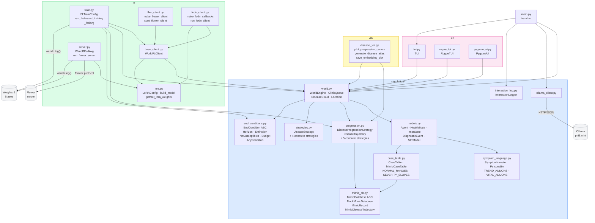
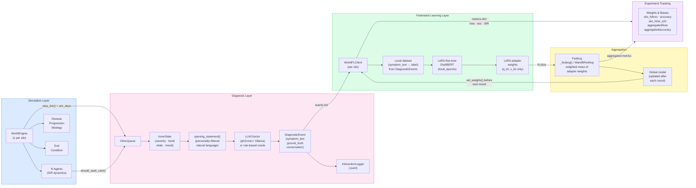

# Module View — Federated Simulated World

**Last updated: 2026-05-29**

Render with any Mermaid-compatible viewer (GitHub, VS Code Mermaid Preview, mermaid.live).

Two views are provided:
- **A** — Package dependency graph (what imports what)
- **B** — Data flow (how information moves from simulation to W&B)

---

## View A — Package Structure & Dependencies



---

## View B — Data Flow: Simulation → Training → Aggregation



---

## View C — FL Round Sequence

```mermaid
sequenceDiagram
    participant Loop as run_federated_training()
    participant S0 as Silo 0 (WorldFLClient)
    participant S1 as Silo 1 (WorldFLClient)
    participant SN as Silo N-1
    participant WB as Weights & Biases

    Note over Loop: Round r = 1..num_rounds

    Loop->>S0: set_weights(global_weights)
    Loop->>S1: set_weights(global_weights)
    Loop->>SN: set_weights(global_weights)

    par simulate + train (per silo)
        S0->>S0: run_simulation_round() — sim_days ticks
        S0->>S0: train_on_events() — local LoRA fine-tune
        S0->>S0: evaluate() — post-train loss + accuracy
    and
        S1->>S1: run_simulation_round()
        S1->>S1: train_on_events()
        S1->>S1: evaluate()
    and
        SN->>SN: run_simulation_round()
        SN->>SN: train_on_events()
        SN->>SN: evaluate()
    end

    S0-->>Loop: weights_0, metrics_0 (loss, acc, SIR, num_events)
    S1-->>Loop: weights_1, metrics_1
    SN-->>Loop: weights_N, metrics_N

    Loop->>Loop: global_weights = _fedavg([w0..wN], [n0..nN])

    Loop->>WB: wandb.log({silo_i/*, aggregated/*}, step=r)

    alt all silos is_done
        Loop->>WB: wandb.log({aggregated/all_silos_done: 1})
        Note over Loop: Early exit
    end
```

---

## Key Data Structures

| Structure | From | To | Contents |
|---|---|---|---|
| `DiagnosticEvent.ground_truth` | `Agent.build_diagnostic_event()` | `WorldFLClient._build_dataset()` | `"{ICD-10 code} / {management tier}"` e.g. `"J10.89 / treat"` |
| `DiseaseTrajectory.icd_code` | `DiseaseProgressionStrategy.sample_trajectory()` | `Agent.build_diagnostic_event()` | ICD-10 code stamped at infection time |
| `DiagnosticEvent` | `ClinicQueue` | `WorldFLClient` | symptom text, ground_truth (ICD/mgmt), severity, conversation, CaseTable |
| `InnerState` | `Agent.inner_state` | `SymptomNarrator` | severity, σ, trend, fatigue, pain, mood, top_vital |
| LoRA weights | `WorldFLClient.get_weights()` | `_fedavg()` | list of np.ndarray (q_lin + v_lin adapters only) |
| `run_round()` dict | `WorldFLClient` | `run_federated_training()` | loss, accuracy (ICD-cat+mgmt), icd_exact_acc, icd_category_acc, mgmt_acc, SIR, num_events |
| W&B log dict | `run_federated_training()` | `wandb.log()` | silo_N/\* + aggregated/\* including icd_category_acc, mgmt_acc |

## ICD-10 Accuracy Scoring

| Prediction vs Ground Truth | Score | Rationale |
|---|:---:|---|
| Exact subcategory match (J10.89 == J10.89) | 1.0 | Fully correct disease identification |
| 3-char category match (J10.xx == J10.89) | 0.5 | Same disease family, wrong specification |
| No match (J11.1 vs J10.89) | 0.0 | Wrong disease |

**Primary metric `accuracy`** = `(icd_category_correct AND mgmt_correct) / N` — clinically acceptable: right disease family, right treatment intensity.
