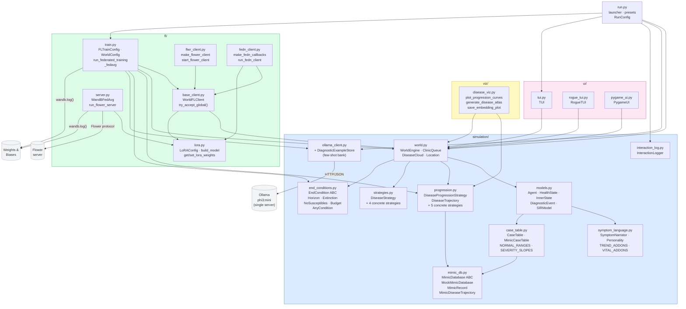
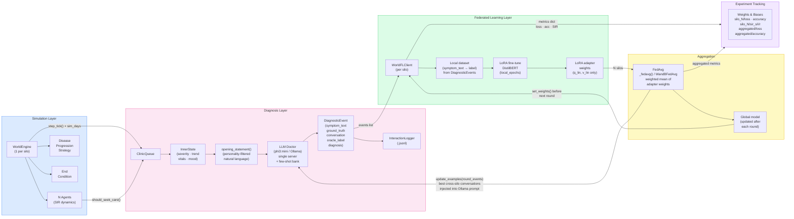

# Module View — Federated Simulated World

**Last updated: 2026-05-29 (session 6)**

Render with any Mermaid-compatible viewer (GitHub, VS Code Mermaid Preview, mermaid.live).

Two views are provided:
- **A** — Package dependency graph (what imports what)
- **B** — Data flow (how information moves from simulation to W&B)

---

## View A — Package Structure & Dependencies



---

## View B — Data Flow: Simulation → Training → Aggregation



---

## View C — FL Round Sequence

Round count is **simulation-guided** — the loop runs until all silos hit their end condition
(default: `ExtinctionCondition`, I=0 for 3 consecutive days) or `max_rounds` is reached.
Silos that finish early enter **frozen mode**: they re-upload their last model each round
and conditionally accept the global model only if it doesn't regress on their frozen eval batch.

```mermaid
sequenceDiagram
    participant Loop as run_federated_training()
    participant SA as Active Silo (WorldFLClient)
    participant SD as Done Silo (WorldFLClient)
    participant OLL as OllamaDiagnosticClient
    participant WB as Weights & Biases

    Note over Loop: Round r = 1..max_rounds (exits early when all done)

    Loop->>SA: set_weights(global_weights)
    Loop->>SD: try_accept_global(global_weights, threshold=0.10)
    Note over SD: Eval global on frozen batch.<br/>Accept if triage_acc drop ≤ 10 %,<br/>else revert to frozen weights.

    par active silo
        SA->>SA: run_simulation_round() — sim_days × TICKS_PER_DAY
        SA->>SA: evaluate() — pre-train metrics on new events
        SA->>SA: train_on_events() — local LoRA fine-tune
    and done silo (frozen)
        SD->>SD: _run_frozen_round() — no simulation, returns cached metrics
    end

    SA-->>Loop: weights (updated), metrics, n_examples
    SD-->>Loop: weights (frozen/accepted), frozen_n for FedAvg weight

    Loop->>Loop: global_weights = _fedavg([all weights], [n_examples or frozen_n])

    Note over Loop: Federated few-shot update (active silos only)
    Loop->>OLL: update_examples(round_events)
    Loop->>WB: wandb.log({silo_i/*, aggregated/*}, step=r)

    alt all silos is_done
        Loop->>WB: wandb.log({aggregated/all_silos_done: 1})
        Note over Loop: Early exit — epidemic extinct
    end
```

---

## Key Data Structures

| Structure | From | To | Contents |
|---|---|---|---|
| `DiagnosticEvent.ground_truth` | `Agent.build_diagnostic_event()` | `WorldFLClient._build_dataset()` | `"{ICD-10 code} / {management tier}"` e.g. `"J10.89 / treat"` |
| `DiseaseTrajectory.icd_code` | `DiseaseProgressionStrategy.sample_trajectory()` | `Agent.build_diagnostic_event()` | ICD-10 code stamped at infection time |
| `DiagnosticEvent` | `ClinicQueue` | `WorldFLClient` | symptom text, ground_truth (ICD/mgmt), severity, conversation, CaseTable |
| `InnerState` | `Agent.inner_state` | `SymptomNarrator` | severity, σ, trend, fatigue, pain, mood, top_vital |
| LoRA weights | `WorldFLClient.get_weights()` | `_fedavg()` | list of np.ndarray (q_lin + v_lin adapters only) |
| `run_round()` dict | `WorldFLClient` | `run_federated_training()` | loss, accuracy (ICD-cat+mgmt), icd_exact_acc, icd_category_acc, mgmt_acc, SIR, num_events |
| W&B log dict | `run_federated_training()` | `wandb.log()` | silo_N/\* + aggregated/\* including icd_category_acc, mgmt_acc |

## Run Presets (`python run.py --preset <name>`)

| Preset | Silos | Agents | Diseases | Notes |
|---|:---:|:---:|---|---|
| `smoke` | 2 | 15 | Standard Flu | Fastest; offline W&B, no Ollama. Use for CI/debugging. |
| `standard` | 3 | 60 | Flu + Mild Corona | Default research run. |
| `multi-disease` | 5 | 100 | Flu, Corona, Slow Burn, Aggressive Flu | IID multi-disease; tests disease identity classification. |
| `non-iid` | 5 | varies | per silo (WorldConfig) | Asymmetric: different disease, beta_scale, population per silo. Key FL research configuration. |
| `hard-triage` | 3 | 80 | Slow Burn + Deadly | Maximum triage difficulty: plateau symptoms + near-zero decay. |

Wizard: select a preset at startup, then optionally customize individual fields.
CLI: `--preset <name>` loads the preset; any additional flags override specific fields.

## Multi-Disease Dynamics

When `progression_strategies` contains multiple diseases:
- Each susceptible agent that crosses the infection threshold is assigned one disease drawn **uniformly at random** from the list.
- The **single-disease-slot rule** (`HealthState.infect()` guards against double-infection) ensures agents can only carry one disease at a time.
- A **14-day refractory period** (`REFRACTORY_DAYS`) runs after recovery before the agent re-enters `SUSCEPTIBLE`. This prevents weekly cycling through multiple diseases.
- Non-IID silos use `WorldConfig.progressions` to give each silo its own disease mix; FedAvg shares learned weights across disease boundaries.

## ICD-10 Accuracy Scoring

| Prediction vs Ground Truth | Score | Rationale |
|---|:---:|---|
| Exact subcategory match (J10.89 == J10.89) | 1.0 | Fully correct disease identification |
| 3-char category match (J10.xx == J10.89) | 0.5 | Same disease family, wrong specification |
| No match (J11.1 vs J10.89) | 0.0 | Wrong disease |

**Primary metric `accuracy`** = `(icd_category_correct AND mgmt_correct) / N` — clinically acceptable: right disease family, right treatment intensity.
