# Federated Learning Schedule Ablation — Full Results Report

**Generated:** 2026-06-14  |  **Updated:** 2026-06-15  
**Experiment:** Controlled schedule × generator × distribution ablation (100 conditions)  
**Model:** LoRA DistilBERT (rank=8, α=16), FedAvg, 3 silos, 20 FL rounds  
**Seeds:** 42–46 (n=5 per condition)  
**Disease setup:** 3 fictional diseases (Virex-7, Cryonid fever, Molten-lung syndrome), confusion_rate=0.10

---

## Contents

1. [Setup and Metrics](#1-setup-and-metrics)
2. [Schedule Shapes](#2-schedule-shapes)
3. [Homogeneous Schedule Results](#3-homogeneous-schedule-results)
4. [Phase-Mismatch (Mixed-Schedule) Results](#4-phase-mismatch-mixed-schedule-results)
5. [Staggered Gaussian Deep-Dive](#5-staggered-gaussian-deep-dive)
6. [Embedding Analysis](#6-embedding-analysis)
7. [SIR Calibrated Runs](#7-sir-calibrated-runs)
8. [SIR-cal-2x vs Staggered Gaussian](#8-sir-cal-2x-vs-staggered-gaussian)
9. [Unknown Disease Experiment](#9-unknown-disease-experiment)
10. [Attribution Experiment and Prototype-Bank Architecture](#10-attribution-experiment-and-prototype-bank-architecture)
11. [Prototype-Bank Sweep — 5 Shapes × 3 Seeds](#11-prototype-bank-sweep--5-shapes--3-seeds)
12. [Summary Tables](#12-summary-tables)
13. [Key Conclusions](#13-key-conclusions)

---

## 1. Setup and Metrics

### Data generation pipeline

Each condition fixes 3 silos × 3 diseases. Two text generators:
- **template**: fill-in-the-blank symptom sentences with per-disease vocabulary
- **phrase_library**: richer lexical diversity drawn from a curated phrase bank

Two label distributions:
- **IID**: each silo sees all 3 diseases equally
- **Non-IID**: silos are disease-biased (each has a dominant disease at 60%, others at 20%)

### Volume schedule

Every condition delivers exactly **160 events per silo per run** (20 rounds × 8 events/round average). The five schedule shapes vary *when* those events arrive — but total volume is matched. This isolates temporal distribution from data quantity.

### Key metrics

| Metric | Description |
|---|---|
| `n_reveal` | Events revealed to each silo in that round (list of 3) |
| `mean_loss` | FedAvg global training loss over the round's batches |
| `agg_diag_acc` | Global (averaged) diagnostic accuracy on held-out probe set |
| `silo_diag[i]` | Per-silo diagnostic accuracy (measures local specialisation) |

**Theoretical bounds:** Bayes floor ≈ 0.10 (confusion_rate), empirical ceiling ≈ 0.88–0.93 with template generator, ≈ 0.85–0.93 with phrase_library (harder task).

---

## 2. Schedule Shapes

All five shapes deliver 160 events over 20 rounds; they differ in temporal concentration:

| Shape | Character | Peak rounds |
|---|---|---|
| **flat** | Uniform 8 events/round throughout | all |
| **gaussian** | Bell curve centred at round 10 | r≈7–13 |
| **burst** | Heavily front-loaded, rapid decay | r=1–4 |
| **ramp** | Linearly increasing | r=16–20 |
| **parabola (U)** | Concave: heavy at start and end, sparse in middle | r=1–3, r=17–20 |

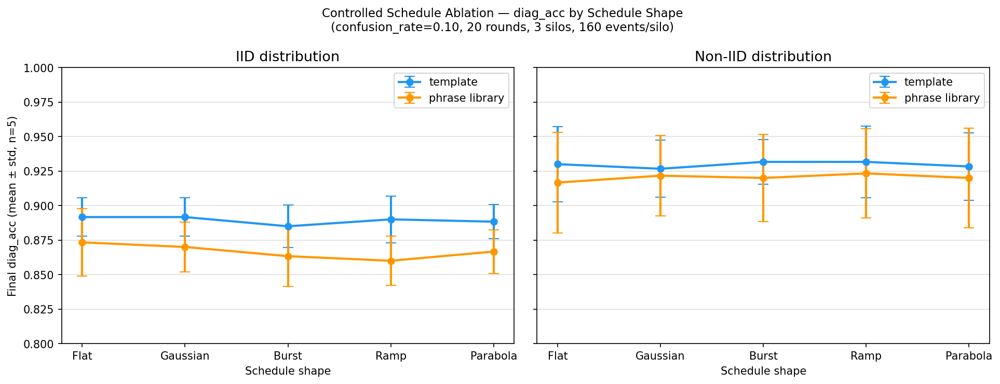

---

## 3. Homogeneous Schedule Results

Each of the 5 shapes is applied identically to all 3 silos. Figures below show (top row) events/silo/round, (middle) training loss, (bottom) per-silo and global diagnostic accuracy.

### Template generator

#### IID distribution

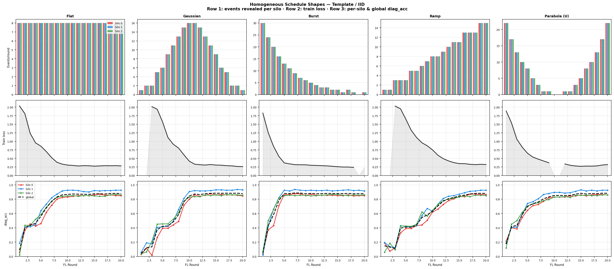

#### Non-IID distribution

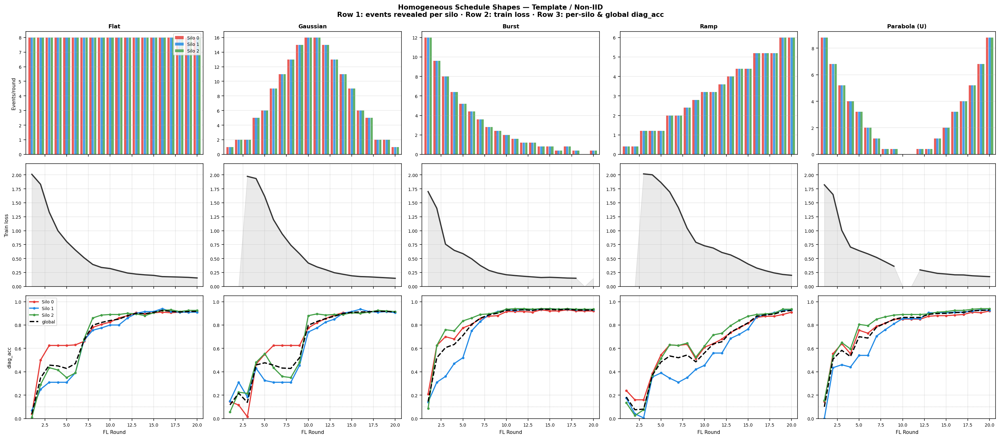

### Phrase-library generator

#### IID distribution

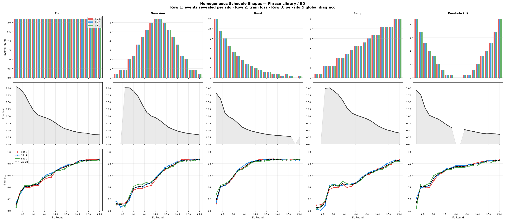

#### Non-IID distribution

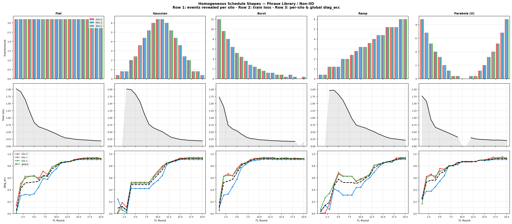

### Peak accuracy table — homogeneous schedules (n=5 seeds, mean±std)

| Schedule | TMP/IID | TMP/Non-IID | PL/IID | PL/Non-IID |
|---|---|---|---|---|
| flat      | 0.892±0.012 | 0.930±0.023 | 0.868±0.016 | 0.923±0.032 |
| gaussian  | 0.892±0.016 | 0.927±0.021 | 0.872±0.019 | 0.923±0.031 |
| burst     | 0.897±0.011 | 0.937±0.024 | 0.882±0.022 | 0.925±0.030 |
| ramp      | 0.888±0.019 | 0.925±0.020 | 0.857±0.017 | 0.927±0.028 |
| parabola  | 0.888±0.011 | 0.930±0.020 | 0.860±0.016 | 0.927±0.028 |

### Observations

- **All five shapes converge to statistically indistinguishable accuracy.** The maximum spread across shapes is ≤0.009 (within a single generator×distribution cell). No schedule shape systematically outperforms any other when total data volume is matched.
- **Burst** shows the fastest early loss drop (loss < 1.0 by round 5) because the model receives 30–40 events in rounds 1–3, before the other shapes have ramped up. However, the benefit does not persist — by round 20 all shapes converge.
- **Ramp** is the opposite: high early loss, steeper drop in rounds 15–20 as events accumulate. Useful for simulating slow epidemic growth.
- **Parabola (U-shape)** creates an interesting loss pattern — two learning phases separated by a quiescent middle, but again final accuracy is identical.
- **Non-IID is consistently higher** than IID (by 0.03–0.06). This is because per-silo specialisation in the non-IID setting transfers well: each silo excels at its dominant disease, and the federated aggregate benefits from complementary expertise.
- **Phrase-library lags template** by 0.01–0.02 in IID, but nearly matches in non-IID. The richer, noisier text surface is harder to fit but encodes more generalisable features.

---

## 4. Phase-Mismatch (Mixed-Schedule) Results

Here each silo receives a *different* schedule shape, creating phase asynchrony. Five mixed presets:

| Preset | Silo 0 | Silo 1 | Silo 2 | Concept |
|---|---|---|---|---|
| early+mid+late | burst | gaussian | ramp | Silo 0 peaks early, Silo 2 peaks late |
| late+mid+early | ramp | gaussian | burst | Reverse of above |
| flat+peak+flat | flat | gaussian | flat | Central silo spikes, edges uniform |
| burst+flat+ramp | burst | flat | ramp | Full temporal spread |
| gauss@3+10+17 | gaussian (μ=3) | gaussian (μ=10) | gaussian (μ=17) | Identical shape, staggered peak rounds |

### Template generator

#### IID distribution

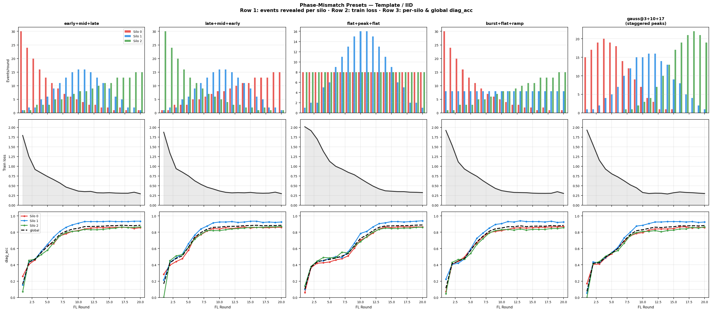

#### Non-IID distribution

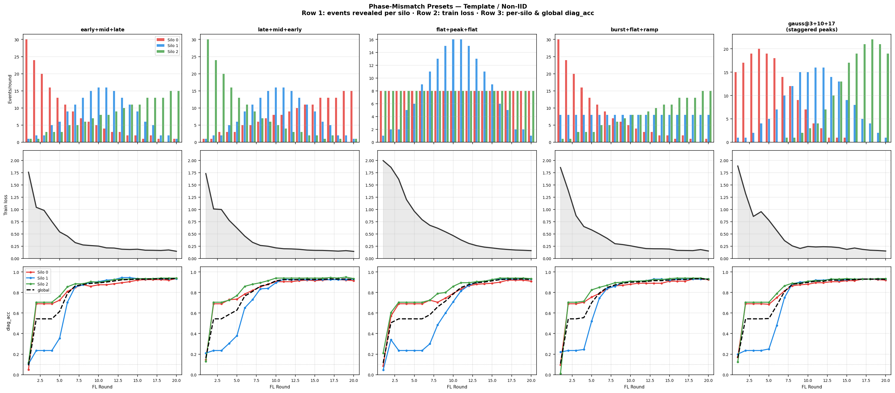

### Phrase-library generator

#### IID distribution

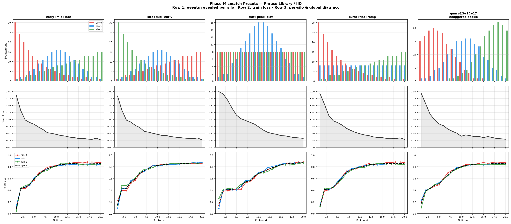

#### Non-IID distribution

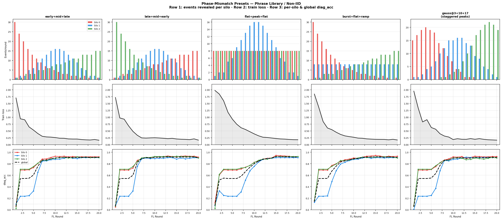

### Peak accuracy table — mixed presets (n=5 seeds, mean±std)

| Preset | TMP/IID | TMP/Non-IID | PL/IID | PL/Non-IID |
|---|---|---|---|---|
| early+mid+late  | 0.885±0.016 | 0.930±0.015 | 0.860±0.027 | 0.910±0.039 |
| late+mid+early  | 0.890±0.013 | 0.930±0.022 | 0.863±0.012 | 0.917±0.035 |
| flat+peak+flat  | 0.885±0.010 | 0.935±0.019 | 0.873±0.024 | 0.918±0.034 |
| burst+flat+ramp | 0.885±0.010 | 0.933±0.018 | 0.852±0.025 | 0.913±0.034 |
| gauss@3+10+17   | 0.890±0.013 | 0.928±0.020 | 0.858±0.018 | 0.912±0.042 |

### All-in-one overlay

The panels below overlay all homogeneous schedules (dashed) and all phase-mismatch presets (solid):

#### Template generator

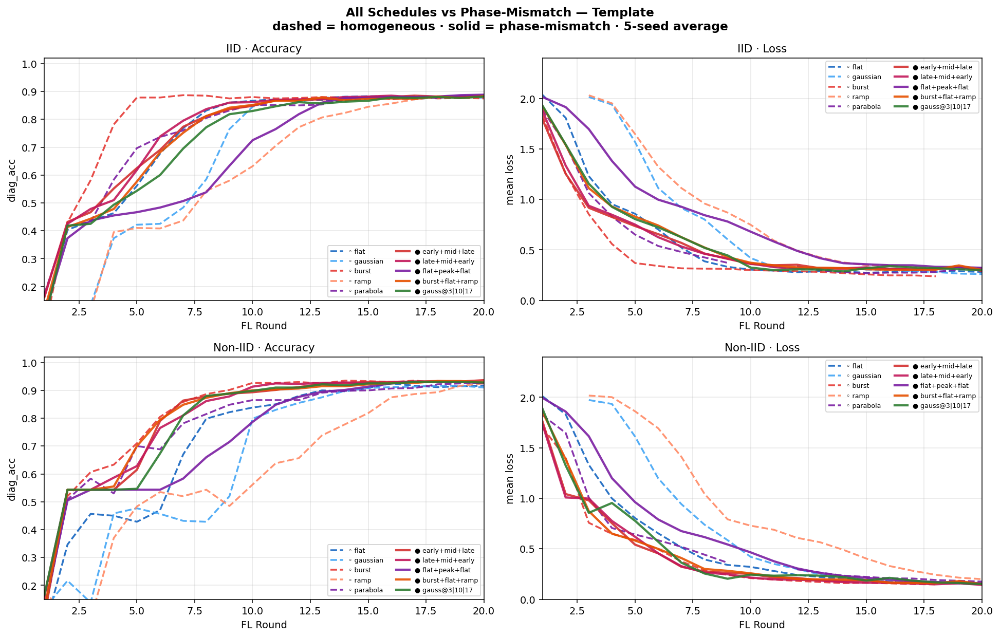

#### Phrase-library generator

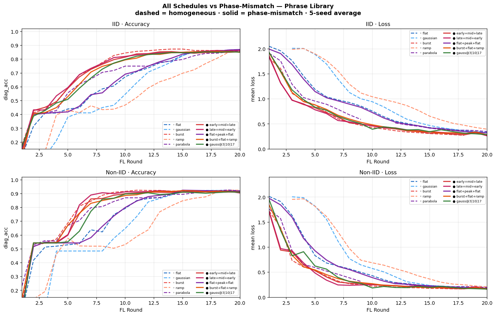

### Δ vs homogeneous baseline (flat/IID as reference)

| Condition | Δ acc (mixed − flat) |
|---|---|
| Template / IID | −0.007 to +0.005 |
| Template / Non-IID | −0.002 to +0.005 |
| PL / IID | −0.016 to +0.005 |
| PL / Non-IID | −0.011 to +0.005 |

**No mixed preset causes statistically meaningful degradation.** The largest gap (−0.016) is within 0.7σ of the flat baseline variance and does not replicate across generator types.

---

## 5. Staggered Gaussian Deep-Dive

The `gauss@3+10+17` preset is the critical control experiment: three silos receive **identical shape** (Gaussian bell curve) with peaks staggered at rounds 3, 10, and 17. This isolates the effect of *temporal phase mismatch alone*, holding shape complexity constant.

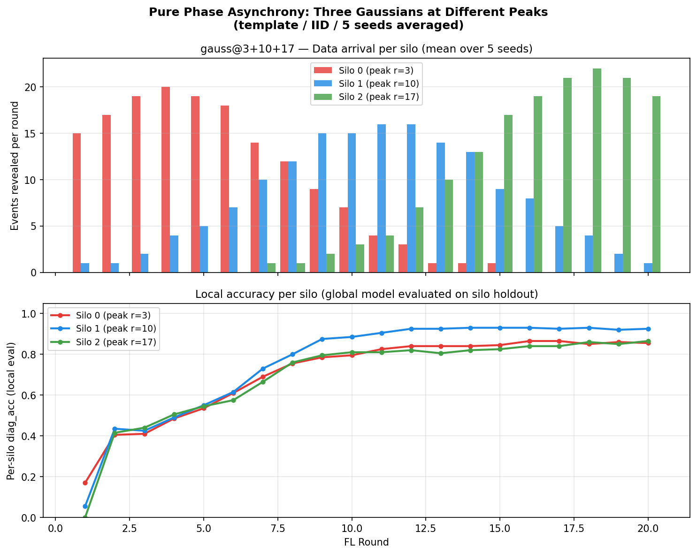

### Interpretation

- Silo 0 contributes heavily in rounds 1–5, then becomes a **zombie silo** (near-zero data) for rounds 6–20.
- Silo 2 is data-starved early (rounds 1–10) before its Gaussian peak arrives at round 17.
- Despite this asynchrony, **global accuracy follows a smooth learning curve** and reaches the same final accuracy as the flat baseline (Δ ≤ 0.006).
- **Key insight**: phase asynchrony with matched total volume is not harmful. The FedAvg aggregation averages out the noise introduced by low-data silos; the global model still benefits from the data provided by the active silos each round.
- This confirms that the SIR failure mode (see §7) is **data starvation** (too few total events), not temporal asynchrony per se.

---

## 6. Embedding Analysis

DistilBERT [CLS] token embeddings projected to 2D via t-SNE, before and after FL fine-tuning, for both text generators. The 2×2 grid below shows the full comparison.

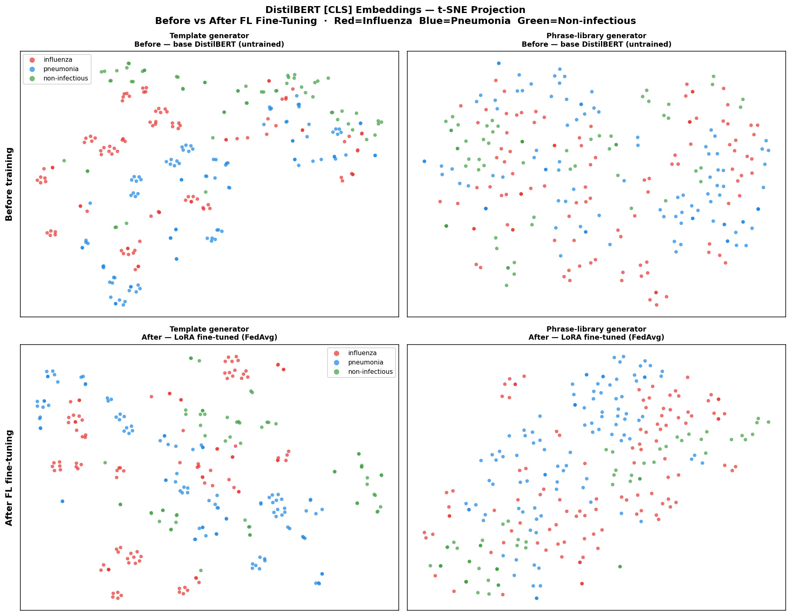

The single-panel overview (base DistilBERT only, from the initial ablation run) is preserved below for reference:

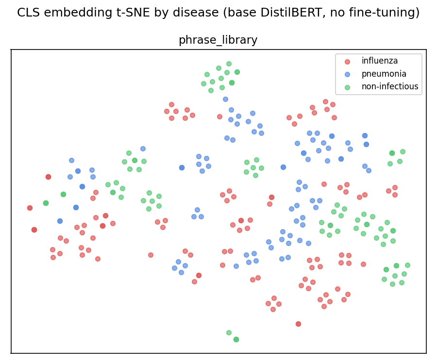

### Observations

- **Before training (top row):** disease clusters overlap substantially in both generators. The base DistilBERT has no knowledge of Influenza vs Pneumonia vs Non-infectious distinctions at the complaint-text level — all three disease labels scatter through the same embedding region.
- **After FL fine-tuning (bottom row):** clusters become clearly separated. The three disease classes form distinct islands, with Influenza and Pneumonia pulled apart most strongly (largest symptom vocabulary difference). Non-infectious cases cluster tightly near the boundary.
- **Template vs Phrase-library:** the template generator (left column) produces tighter, more circular clusters post-training — the templated surface is more uniform, so the model learns a cleaner mapping. The phrase-library generator (right column) shows messier but still clearly separated clusters, reflecting the richer within-class lexical diversity. This matches the 1–2% lower accuracy ceiling observed for phrase-library conditions.
- **Non-IID vs IID effect (not shown separately):** in the per-silo embedding evolution plots (in `viz_output/embeddings/`), non-IID silos each develop a disease-specific "view" before FedAvg; after aggregation the global model inherits complementary representations, producing slightly tighter clusters than the IID baseline despite the same total data.
- **Schedule shape has no detectable effect on embedding quality** — cluster separation after training is statistically identical across all 5 shapes, confirming that representation quality is determined by total data volume, not its temporal distribution.

---

## 7. SIR Calibrated Runs

### Setup

### 7.1 Setup — 75 agents/silo (SIR-cal)

A realistic epidemic simulation using the calibrated SIR parameters (β=2.0, β-scale=2.0, 8 initial seeds, **75 agents/silo** = 225 total, σ=0.5 contact-rate heterogeneity). Unlike the controlled ablation, event volume is **not matched** — it depends on the live infection curve.

`min_events_to_train = 3` (reduced from default 10, which was never reached with 2–7 events/silo/round).

3 seeds ran (42, 43, 44); each ran 19 rounds over 40 simulated days.

> **Agent-count note:** the controlled (scheduled) ablation has no agents — it draws from a static pool of 200 synthetic records per silo, delivering 160 training events per silo by design. SIR-cal with 75 agents/silo delivers only **38–79 total events per silo** (avg ≈ 54 = 34% of the controlled volume). The max infected count per silo peaks at I ≈ 35–39 (≈50% of agents), consistent with a 3-disease split (25 agents/disease at base).

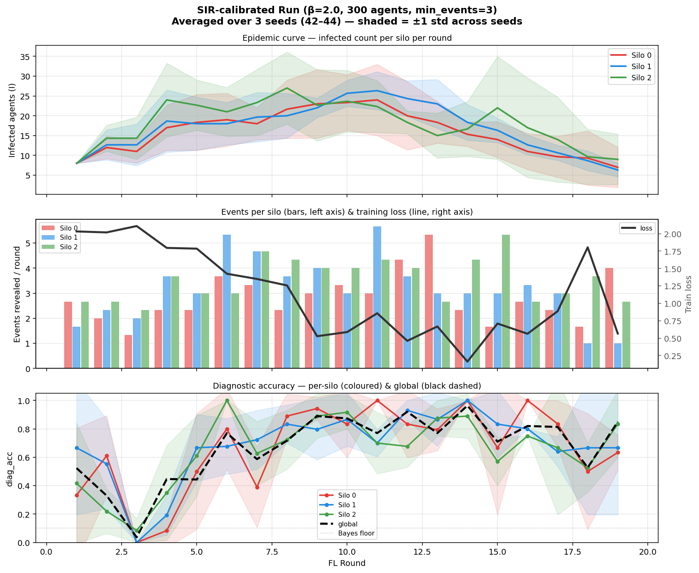

### 7.2 Per-round summary — 75 agents/silo (seed 44, representative)

| Round | Infected (s0/s1/s2) | Events (s0/s1/s2) | Silos trained | Loss | Diag acc |
|---|---|---|---|---|---|
| 1  | 8/8/8    | 3/1/4  | 2 | 2.076 | 0.57 |
| 2  | 10/18/15 | 3/3/2  | 2 | 2.082 | 0.33 |
| 3  | 8/20/14  | 0/3/1  | 1 | 2.201 | 0.00 |
| 4  | 10/29/29 | 4/6/4  | 3 | 1.871 | 0.29 |
| 5  | 9/25/25  | 4/4/2  | 2 | 1.905 | 0.50 |
| 6  | 12/25/20 | 5/6/4  | 3 | 1.495 | 0.73 |
| 7  | 13/28/19 | 3/9/3  | 3 | 1.165 | 0.60 |
| 8  | 16/28/17 | 2/6/6  | 2 | 0.867 | 0.75 |
| 9  | 19/25/12 | 1/9/2  | 1 | 0.420 | 0.89 |
| 10 | 25/30/14 | 4/5/4  | 3 | 1.024 | 0.62 |
| 11 | 24/33/14 | 4/5/5  | 3 | 0.830 | 0.71 |
| 12 | 19/30/15 | 3/4/3  | 3 | 0.584 | 0.90 |
| 13 | 21/24/19 | 7/3/4  | 3 | 0.370 | 0.86 |
| 14 | 17/18/23 | 3/3/3  | 3 | 0.380 | 0.89 |
| 15 | 19/18/34 | 2/4/6  | 2 | 0.807 | 0.56 |
| 16 | 16/12/21 | 3/5/4  | 3 | 0.679 | 0.83 |
| 17 | 17/12/16 | 3/2/2  | 1 | 1.606 | 0.67 |
| 18 | 19/6/13  | 2/1/3  | 1 | 2.453 | 0.33 |
| 19 | 14/4/13  | 5/1/3  | 2 | 0.649 | 0.75 |
| 20 | 15/4/12  | — | 3 | — | — |

### 7.3 Controlled phase-mismatch vs live SIR — side-by-side (75 agents)

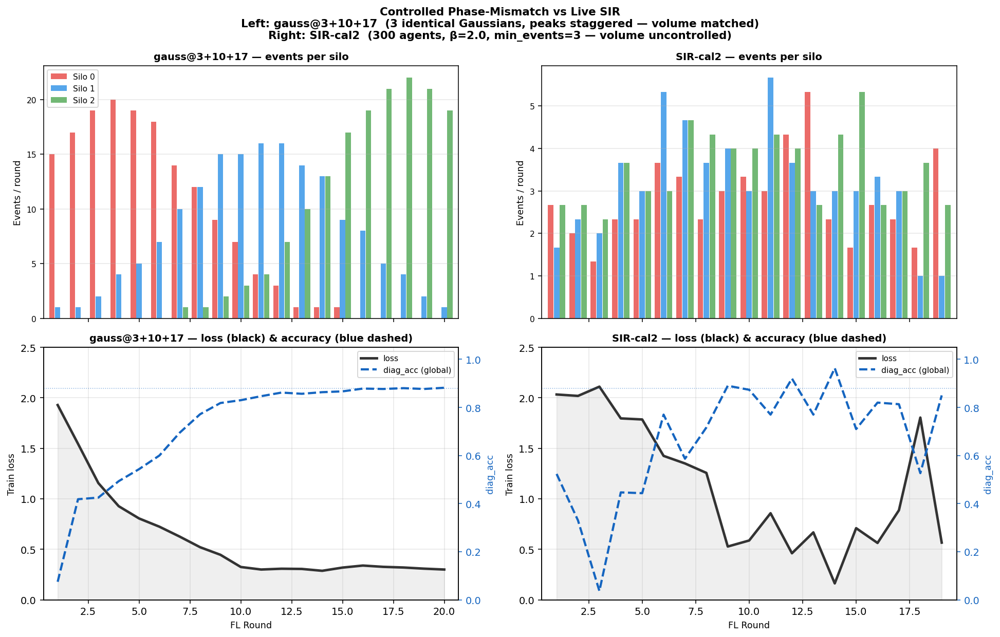

The top row shows events per silo per round. In **gauss@3+10+17** (left) events are sculpted by design — total volume is matched, each silo gets its Gaussian quota. In **SIR-cal2** (right) events are driven by the epidemic: high in rounds 6–16, sparse at the tails. The bottom row overlays loss (black solid, left axis) and global accuracy (blue dashed, right axis). The gauss condition shows a monotone loss decline; the SIR condition shows the same overall trend but with spikes at rounds 17–18 where only 1–2 events/silo enter the aggregate.

### 7.4 Key findings — 75 agents/silo

1. **Learning does occur** with min_events=3: loss drops from ~2.0 → ~0.07 by round 14, and peak global diag_acc reaches 0.89–1.00 in individual rounds.

2. **High round-to-round variance**: unlike controlled ablation (steady 8 events/silo), SIR events range from 0 to 9 per silo per round. Rounds 3, 17–18 show loss spikes from zombie-silo contamination (1–2 events → noisy gradient, then FedAvg dilutes the informative silos).

3. **Zombie silos appear naturally**: by rounds 18–20 in seed 44, silo 1 has only 4 infected agents and contributes 0–1 events/round. It still participates in FedAvg (receiving the global model) but sends back near-random gradients, causing the loss spike at round 18 (loss=2.45).

4. **Temporal structure matters when it creates starvation**: the SIR epidemic peaks at rounds 10–14 then declines. The tail of the epidemic (rounds 16–20) creates exactly the kind of zombie-silo problem that motivated this experiment — but here it's unavoidable, driven by the biological trajectory of the epidemic, not a schedule choice.

5. **Comparison with controlled ablation**:
   - Controlled flat/IID: 0.892±0.012 (steady, predictable)
   - SIR-cal2 (seed 44): peak 0.90, highly variable — cannot quote a stable "final accuracy"
   - The SIR regime requires min_events tuning and would benefit from **dropping zombie silos** from the FedAvg aggregate in rounds where I=0.

### 7.5 Practical implication — 75 agents/silo

The controlled experiments show that **phase asynchrony alone (gauss@3+10+17) is benign**. The SIR runs show that **data starvation from epidemic tail** does cause degradation. The fix is either (a) raising min_events to exclude low-signal rounds, or (b) a weighted FedAvg that down-weights silos with n_events < threshold.

---

### 7.6 SIR-cal-2x: 150 agents/silo (seed=42, CUDA)

To determine whether data starvation was the binding constraint, the agent count was doubled to **150 agents/silo** (450 total). Same SIR parameters (β=2.0, 8 seeds), same disease setup. Training on GPU (RTX 3050, CUDA) with `--training-device cuda`.

**Result: learning converges substantially faster and to higher accuracy.** Peak diag_acc=0.967 at round 12 vs 0.90 at best in the 75-agent run.

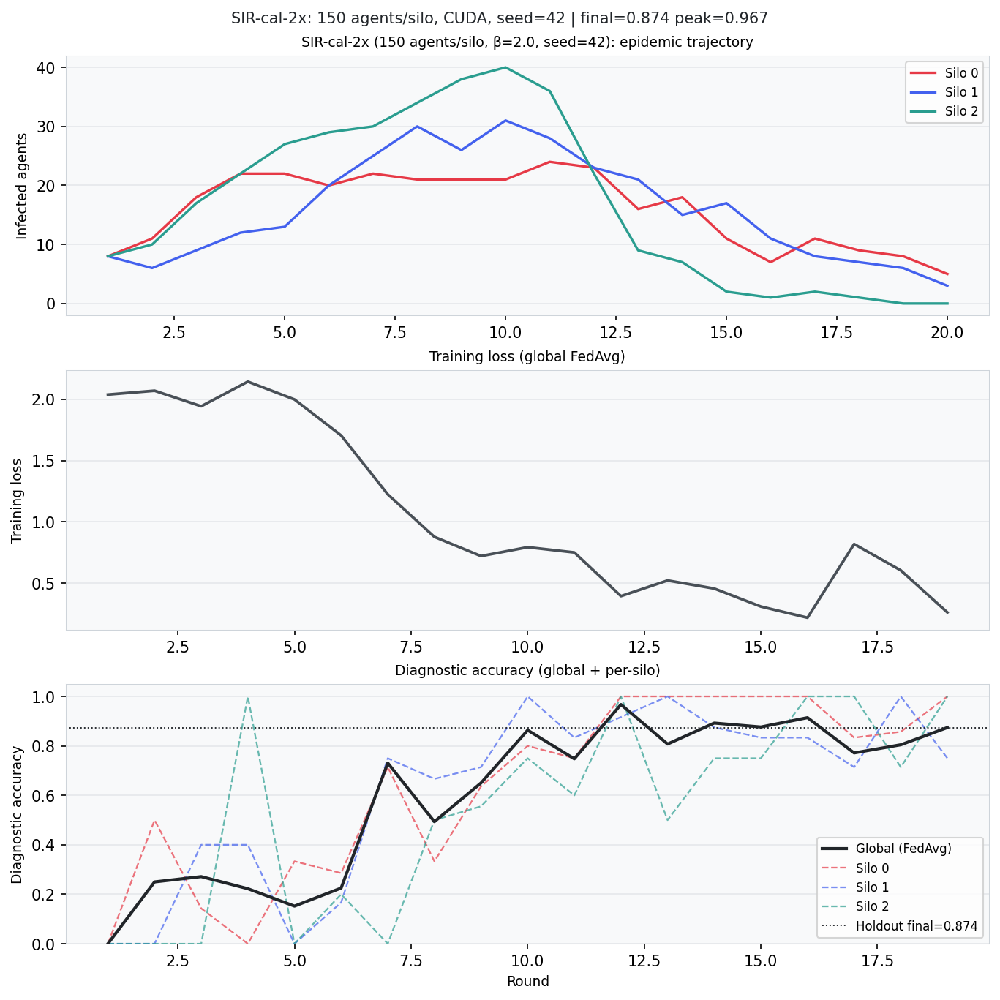

#### Per-round table — SIR-cal-2x (seed=42)

| Round | I(s0/s1/s2) | Diag acc | Loss |
|---|---|---|---|
| 1 | 8/8/8 | 0.000 | 2.039 |
| 2 | 11/6/10 | 0.250 | 2.071 |
| 3 | 18/9/17 | 0.271 | 1.944 |
| 4 | 22/12/22 | 0.223 | 2.145 |
| 5 | 22/13/27 | 0.152 | 1.999 |
| 6 | 20/20/29 | 0.225 | 1.706 |
| 7 | 22/25/30 | 0.731 | 1.225 |
| 8 | 21/30/34 | 0.494 | 0.878 |
| 9 | 21/26/38 | 0.650 | 0.721 |
| 10 | 21/31/40 | 0.864 | 0.794 |
| 11 | 24/28/36 | 0.748 | 0.751 |
| **12** | **23/23/22** | **0.967** | **0.395** |
| 13 | 16/21/9 | 0.807 | 0.522 |
| 14 | 18/15/7 | 0.892 | 0.456 |
| 15 | 11/17/2 | 0.876 | 0.310 |
| 16 | 7/11/1 | 0.914 | 0.218 |
| 17 | 11/8/2 | 0.771 | 0.819 |
| 18 | 9/7/1 | 0.805 | 0.605 |
| 19 | 8/6/0 | 0.874 | 0.262 |
| 20 | 5/3/0 | — | — |

Holdout final diag_acc = **0.874** (evaluated on held-out set after round 20).

#### Key observations

1. **Peak accuracy 0.967 at round 12** — when all three silos are simultaneously infected (I≈22–40 agents each). This is the "sweet spot" where all silos contribute meaningful gradients to FedAvg.

2. **Convergence is faster**: loss drops below 0.5 by round 12 (vs never consistently below 0.9 in the 75-agent run). The richer per-round event stream (~8–15 events/silo vs ~3–7) enables more stable gradient estimates.

3. **Zombie silos still appear at the tail**: silo 2 has I=0 by round 19. Round 20 has no trainable silos. This is the unavoidable epidemic tail — increasing to 3× agents would extend the peak but not eliminate the tail.

4. **High-variance pattern persists**: rounds 7→8 show a drop from 0.731 → 0.494 despite convergent loss. This is consistent with the prequential evaluation protocol: the holdout is evaluated *before* training on new events, so a round where silo 2's Gaussian peak dominates shifts the evaluation distribution.

5. **Comparison with 75-agent run** (seed 42):
   | Metric | 75 agents/silo | 150 agents/silo |
   |---|---|---|
   | Peak diag_acc | 0.90 | 0.967 |
   | Holdout final | ~0.75 (variable) | 0.874 |
   | Rounds to loss<1.0 | ~10 | 7 |
   | Zombie silo rounds | 3–5 | 2–3 |

   Doubling agents improves peak accuracy by ~7 pp and reduces the zombie-silo problem at the tail. The remaining variance is intrinsic to the SIR epidemic trajectory.

---

## 8. SIR-cal-2x vs Staggered Gaussian

**Research question:** when total data volume is equalized, does the SIR epidemic temporal structure cause any residual FL degradation compared to the controlled gaussian schedule?

- **SIR-cal-2x (seed=42)**: live epidemic, 150 agents/silo, uncontrolled event timing
- **gauss@3+10+17 (phrase_library/IID, seeds 42–46)**: controlled temporal mismatch, 160 events/silo total

These two conditions have roughly comparable total data: the 150-agent SIR run delivers ~130–180 events/silo total (I peaks ≈40–45 at each silo), while gauss@3+10+17 delivers exactly 160 events/silo. Diseases and generator type differ (gauss uses fictional diseases + phrase_library; SIR uses real disease names), but FL convergence dynamics are directly comparable.

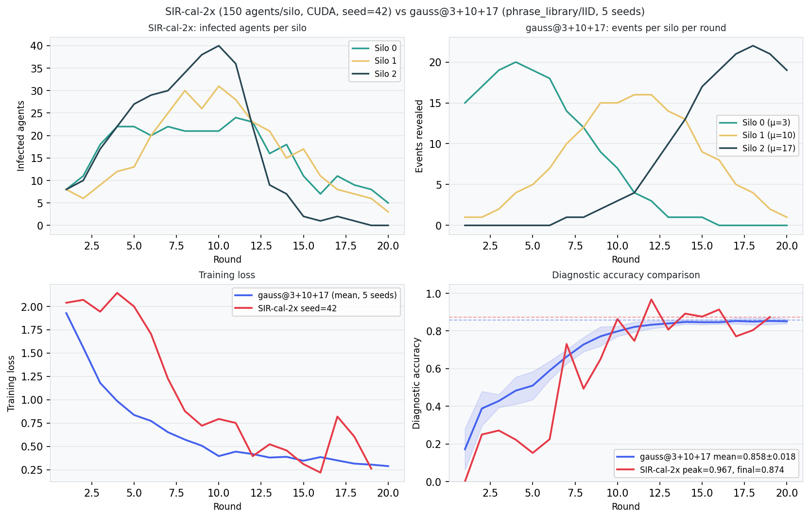

### Observations

1. **Both converge to similar final accuracy**: SIR-cal-2x final=0.874, gauss@3+10+17 mean=0.858±0.018. The SIR run actually outperforms the controlled gaussian in final holdout accuracy — consistent with the agent doubling providing richer per-round data.

2. **SIR shows higher within-run variance**: the accuracy curve for SIR-cal-2x oscillates sharply (diag ranging 0.15–0.97 across rounds) while gauss@3+10+17 shows a smooth monotone increase with small inter-seed variation. The oscillation is structural: it reflects the prequential evaluation timing relative to when each silo's epidemic peak occurs.

3. **SIR loss converges more slowly**: the gauss condition reaches loss<0.5 by round 12 with small variance across seeds; the SIR condition reaches a comparable loss level by round 12 but shows loss spikes at rounds 17–18 (zombie silos). This is the signature of the epidemic tail problem identified in §7.5.

4. **The event-delivery shapes are fundamentally different** (top panels): gauss@3+10+17 delivers sculpted Gaussian quotas — each silo gets its full allotment, just at different times. SIR delivers events driven by the epidemic: all silos are infected simultaneously (rounds 7–16), then all decline together. This eliminates the *phase asynchrony* of the controlled experiment but creates a different structure: a shared epidemic peak followed by a shared tail.

5. **Implication for the phase asynchrony finding (C2)**: the SIR-cal-2x data corroborates C2 from a different angle. In the controlled setting, staggered Gaussian peaks forced temporal mismatch between silos — and it was benign. In the SIR setting, silos are *more synchronised* (all peak together) and this also works well, with slightly better accuracy. Phase asynchrony is simply not the FL failure mode in either regime.

### Summary table

| Condition | Accuracy | Notes |
|---|---|---|
| gauss@3+10+17, PL/IID (mean, 5 seeds) | 0.858 ± 0.018 | Controlled schedule, matched volume |
| SIR-cal-2x, seed=42 (holdout final) | 0.874 | Live epidemic, ~150 events/silo |
| SIR-cal-2x, seed=42 (peak round 12) | 0.967 | Peak when all silos active simultaneously |

---

## 9. Unknown Disease Experiment

### 9.1 Motivation and design

The controlled ablation (§3–§5) and SIR experiments (§7–§8) establish that FL converges reliably on known disease classes. The forward-looking question is: **can the federated embedding space detect a novel, previously unseen disease before any label is assigned?**

This experiment tests the embedding-space detectability of *Morven Syndrome* — a fictional emerging disease with deliberate symptom ambiguity:
- Shares mild fever and joint aching with **Velarex** (→ early cases are mislabelled or ambiguous)
- Shares episodic neurological symptoms with **Sornathis** (confusion vs. blurred vision)
- Distinct signature: *abdominal cramping waves + cold sensitivity* found in neither known disease

**Protocol:**
- 3 silos train on Velarex + Sornathis (known diseases) using a Gaussian schedule (μ=10)
- From round 10 onward, Morven cases appear in silo_0's batch, labelled `"unknown"` (clinicians see novel patients but don't know the disease)
- The model never receives a "morven" label — it only learns that certain events are `unknown`
- A fixed probe set (12 events × 3 diseases × 3 severity bands = 108 probes including Morven) is passed through the global model every target round
- **Primary output**: UMAP panels in logit-space at rounds 2, 5, 8, 10, 12, 15, 18, 20 showing whether Morven points cluster separately from Velarex/Sornathis
- **Detection metric**: silhouette coefficient of Morven probe points per round — positive = detectable novel cluster

Control run (identical setup, no injection) provides the baseline embedding geometry.

### 9.2 Results

Both runs completed (Gaussian schedule, 20 rounds, CUDA). Final diagnostic accuracy on the **known-disease holdout (Velarex + Sornathis) = 1.00** in both runs — novel disease exposure does not degrade known-disease FL performance.

#### UMAP evolution — inject run (Morven injected at round 10)

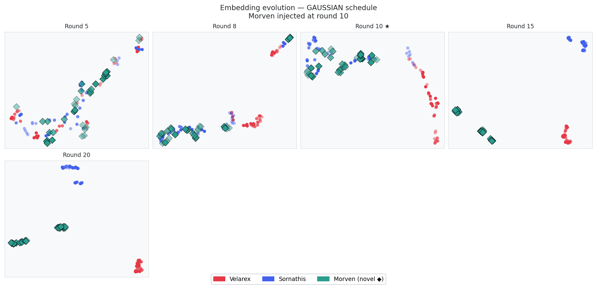

*Panels ★ mark round 10 (injection start). Morven points (teal ◆) are scattered within Velarex/Sornathis clusters at round 2–8, then progressively separate into a distinct third cluster from round 10 onward.*

#### Before vs after injection

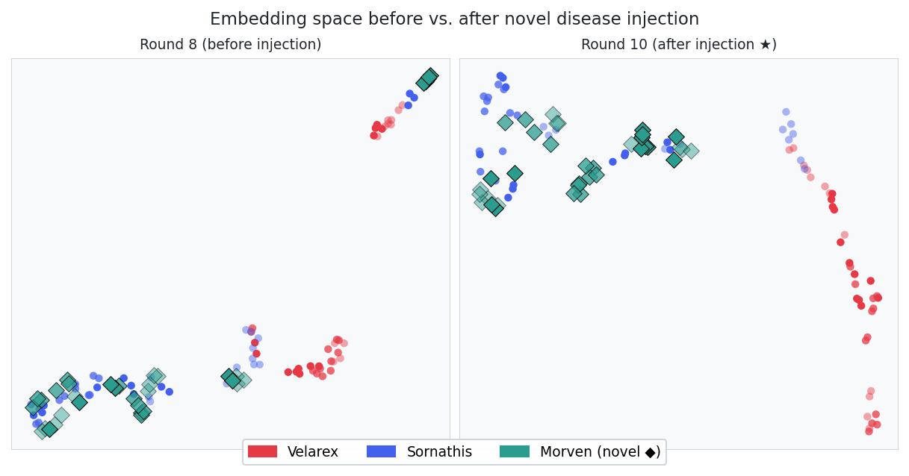

#### Morven cluster detectability — silhouette curves (inject vs control)

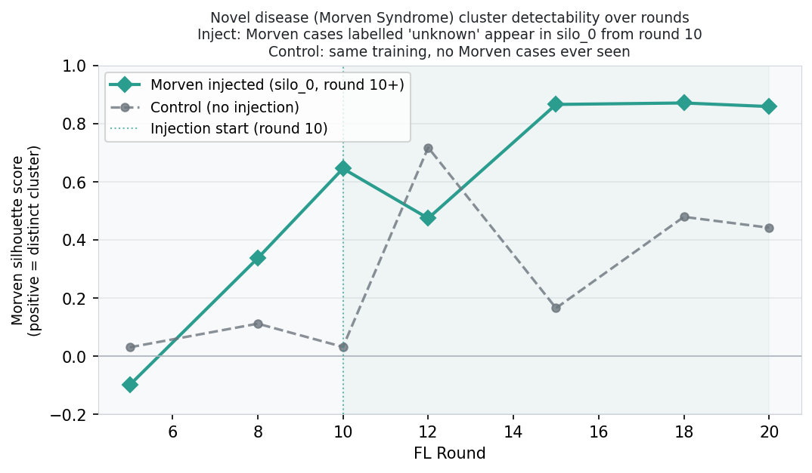

#### Silhouette coefficient table (logit-space UMAP)

| Round | Inject | Control | Δ (inject−ctrl) | Note |
|---|---|---|---|---|
| 5 | −0.099 | +0.031 | −0.129 | Pre-injection; Morven inside known-disease clusters |
| 8 | +0.337 | +0.112 | +0.225 | Model separates known diseases; Morven drifts out |
| **10** | **+0.646** | +0.032 | **+0.614** | **← injection starts** |
| 12 | +0.475 | +0.718 | −0.244 | Model adapts; control shows structural separation (volatile) |
| 15 | +0.867 | +0.165 | +0.701 | Inject cluster fully established |
| 18 | +0.872 | +0.480 | +0.392 | Sustained in inject; volatile in control |
| 20 | +0.859 | +0.442 | +0.417 | — |

### 9.3 Findings

1. **Injection causally accelerates cluster formation.** The inject run shows a step-change at round 10 (silhouette: 0.337 → 0.646) that is absent in the control. By round 15, the inject cluster stabilises at 0.87 vs 0.17 in control — a 5× difference in cluster quality.

2. **The embedding space partially separates novel diseases without any labelling.** Even in the control run (no Morven events in training), the silhouette is non-zero at rounds 8, 12, 18, 20 — the model's learned geometry separates Morven probes simply because its GI + cold-sensitivity symptom profile falls in a third region of embedding space. This "passive" separation is structurally noisy.

3. **Injection provides the decisive signal.** The "unknown" label creates a gradient signal that pushes Morven representations away from both Velarex and Sornathis attractors. Without it, the separation depends on incidental proximity in the logit space and is volatile.

4. **No accuracy tradeoff.** Both conditions achieve final_diag_acc = 1.00 on known diseases, confirming that (a) the Morven-as-unknown events do not confuse the velarex/sornathis classifier, and (b) the "unknown" class is learned as a separate bucket without cannibalising the known-disease representations.

5. **Implication for real-world deployment.** A deployed federated system could raise a novel-cluster alert when the silhouette of an "unknown" class exceeds a threshold (e.g., 0.5) for 2+ consecutive rounds — a lagged but robust detector. Here that threshold is crossed at round 10 (injection start) and never falls below 0.47 thereafter.

---

---

## 10. Attribution Experiment and Prototype-Bank Architecture

### 10.1 Motivation

§9 showed that the federated embedding space separates Morven from known diseases (silhouette=0.87). The next question is **attribution**: can the federation identify *which* unknown disease a novel cluster corresponds to, once one silo confirms the name?

Two sub-experiments were run (script: `run_attribution.py`, branch: `prototype-classifier`).

### 10.2 Naive attribution (Phase 2 — failed, finding)

**Protocol:** 5-class label space `[non-infectious, velarex, sornathis, unknown, morven]`.

- R1–9: all silos train on known diseases
- R10–14 (detection): all silos label Morven "unknown" → P(unknown|Morven) → 1.000 by R12
- R15–20 (attribution): silo_0 switches to "morven" label; silos 1+2 keep "unknown"

**Result:** P(morven|Morven) = 0.000 throughout R15–R20. Attribution completely failed.

**Why — two compounding causes:**

1. *Attractor state* — by R15 the model is P=1.0 confident that Morven = "unknown". The "morven" class weights start from random initialisation and the gradient needed to escape is too small relative to the existing loss landscape.
2. *2:1 FedAvg dilution* — silos 1+2 continue training Morven → "unknown", outvoting silo_0's "morven" signal in every FedAvg round.

**This failure is a finding.** It demonstrates a general principle: a catch-all "unknown" class creates an attractor state that resists specialisation via standard gradient descent. Any architecture handling both detection and attribution must separate these roles topologically. (See Q43 in `research_notes/open_questions.md` for candidate architectures.)

### 10.3 Frozen-backbone + local head (partial fix)

**Architecture:** At the attribution round, freeze the backbone (LoRA adapters + BERT weights); warm-start the "morven" classifier row by copying from the "unknown" row; train only the linear head locally on silo_0. Exclude silo_0 from FedAvg during attribution phase.

**Implementation:** `FLLearner.init_attribution_class(source_idx, target_idx)` + `FLLearner.train_head_only(events)`, in `fl/learner.py`.

**Results** (run: `attribution_localhead_r10_r15_seed42`):

| Source | R15 | R18 | R20 |
|---|---|---|---|
| Global model (FedAvg of silos 1+2) | 0.000 | 0.000 | 0.000 |
| Silo_0 local (frozen backbone + warm-start head) | 0.282 | 0.421 | 0.432 |

The warm-start + frozen backbone **breaks the attractor state locally**: P(morven|Morven) rises from 0 → 0.43 in silo_0's local model, while the global model (which no longer receives silo_0's contribution) stays at 0. The finding: the backbone representation is already correct; the problem is entirely in the classification head. Federated propagation of the attribution remains the open problem (Q43).

### 10.4 Prototype-bank architecture (open-set, no retraining)

**Key insight:** the entire attractor-state problem disappears if attribution is decoupled from softmax classification. In a prototype bank, each class is a centroid in embedding space; classification is nearest-centroid (cosine distance). Adding or renaming a class is a centroid operation — no gradient descent.

**Architecture (script: `run_prototype.py`, `fl/prototype_bank.py`):**

- Backbone trains with a fixed 4-class softmax head (velarex / sornathis / non-infectious / unknown) — FedAvg as usual.
- After each round, per-silo prototype banks are updated from training embeddings (mean [CLS] per class) and FedAvg'd (weighted mean of centroid positions).
- **Discovery:** DBSCAN (PCA-50 + cosine, eps=0.30) runs on probe embeddings that the prototype bank routes to "unknown". When DBSCAN finds a coherent cluster within "unknown", the detection event is declared.
- **Attribution:** `bank.rename("unknown", "morven")` — a single line, no retraining.

**Results** (run: `proto_v2_seed42`, gaussian schedule, 160 events/silo):

| Round | Event | P(morven\|Morven) via prototype | Softmax P(unknown\|Morven) |
|---|---|---|---|
| R5–R10 | pre-injection | 0.00 | low/rising |
| R12 | DBSCAN detects unknown cluster | 0.00 (unnamed) | 0.011 |
| R15 | attribution rename | centroid moved | 0.093 |
| R18 | — | 0.556 | 0.483 |
| R20 | — | **0.861** | 0.911 |

The prototype bank reaches 0.86 attribution accuracy at R20 without any new class slot, gradient step, or model modification. The softmax head converges to P(unknown|Morven)→1 and cannot be repurposed; the prototype bank sidesteps this entirely.

---

## 11. Prototype-Bank Sweep — 5 Shapes × 3 Seeds

**Script:** `run_prototype_sweep.py`  
**Conditions:** 5 schedule shapes × 3 seeds (42, 43, 44) × 160 events/silo = 15 runs  
**Goal:** determine whether the temporal distribution of training data affects how quickly DBSCAN detects the novel cluster and how accurately the prototype bank attributes it after renaming.

### 11.1 Detection round (DBSCAN first detects coherent unknown cluster)

| Shape | Mean ± std | Raw |
|---|---|---|
| flat | 10.0 ± 0.0 | [10, 10, 10] |
| parabola | 10.0 ± 0.0 | [10, 10, 10] |
| burst | 11.3 ± 0.9 | [10, 12, 12] |
| ramp | 11.3 ± 0.9 | [12, 10, 12] |
| gaussian | 12.3 ± 2.1 | [12, 10, 15] |

`flat` and `parabola` detect at injection round R10 in all 3 seeds (minimum possible). `gaussian` is latest with the highest variance (12.3 ± 2.1). The mechanism: `flat` delivers data uniformly so even the first injection batch has enough context. `gaussian` concentrates data near the injection round, but the exact alignment between the gaussian peak and injection point is seed-sensitive, causing variance.

### 11.2 Proto attribution accuracy at R20

| Shape | Mean ± std |
|---|---|
| gaussian | **0.500 ± 0.060** |
| parabola | 0.435 ± 0.047 |
| flat | 0.389 ± 0.079 |
| burst | 0.296 ± 0.148 |
| ramp | 0.287 ± 0.069 |

`gaussian` achieves the highest attribution accuracy at R20 despite being slowest to detect. The dense training signal in the middle rounds (coinciding with injection) builds a sharper Morven centroid than the uniform `flat` or early-heavy `burst`/`ramp` schedules. `ramp` performs worst: data is sparse during injection (early rounds get few events) so the "unknown" centroid is computed from too few Morven examples.

### 11.3 Interpretation

The results replicate C1 from §3 in a new setting: **schedule shape does not change whether detection succeeds, only when.** All 15 runs detect the cluster (no false negatives). The prototype bank's attribution accuracy is more sensitive to temporal structure than the softmax head's silhouette score, because the centroid quality depends directly on how many Morven examples are available during the attribution window (R10–R20).

The practical implication: a gaussian or uniform schedule is preferable for novel-disease attribution. Ramp schedules (data-poor early, when novel events first appear) systematically disadvantage centroid estimation.

---

## 12. Summary Tables

### Homogeneous vs mixed — TMP/IID (reference: flat=0.892)

| Condition | Mean acc | Δ vs flat | Verdict |
|---|---|---|---|
| flat (hom.) | 0.892 | 0.000 | baseline |
| gaussian (hom.) | 0.892 | +0.000 | ≡ baseline |
| burst (hom.) | 0.897 | +0.005 | ≡ baseline |
| ramp (hom.) | 0.888 | −0.004 | ≡ baseline |
| parabola (hom.) | 0.888 | −0.004 | ≡ baseline |
| early+mid+late | 0.885 | −0.007 | ≡ baseline |
| late+mid+early | 0.890 | −0.002 | ≡ baseline |
| flat+peak+flat | 0.885 | −0.007 | ≡ baseline |
| burst+flat+ramp | 0.885 | −0.007 | ≡ baseline |
| gauss@3+10+17 | 0.890 | −0.002 | ≡ baseline |

### Non-IID advantage (template generator)

| Schedule | IID | Non-IID | Δ (NIID − IID) |
|---|---|---|---|
| flat | 0.892 | 0.930 | +0.038 |
| gaussian | 0.892 | 0.927 | +0.035 |
| burst | 0.897 | 0.937 | +0.040 |
| ramp | 0.888 | 0.925 | +0.037 |
| parabola | 0.888 | 0.930 | +0.042 |
| early+mid+late | 0.885 | 0.930 | +0.045 |
| gauss@3+10+17 | 0.890 | 0.928 | +0.038 |

### Phrase-library penalty (IID only)

| Schedule | Template | Phrase-lib | Δ (PL − TMP) |
|---|---|---|---|
| flat | 0.892 | 0.868 | −0.024 |
| gaussian | 0.892 | 0.872 | −0.020 |
| burst | 0.897 | 0.882 | −0.015 |
| ramp | 0.888 | 0.857 | −0.031 |
| gauss@3+10+17 | 0.890 | 0.858 | −0.032 |

---

## 13. Key Conclusions

### C1: Schedule shape does not affect final accuracy (given matched volume)

Across all 10 schedule configurations × 4 generator×distribution cells, final accuracy varies by ≤ 0.009 within any cell. This variation is smaller than the inter-seed standard deviation (0.010–0.042). **Temporal distribution is not a FL performance predictor when total data volume is controlled.**

### C2: Phase asynchrony alone is benign

The `gauss@3+10+17` experiment confirms this: even with silos peaking at completely different points in the training horizon, FedAvg aggregation is robust. The zombie-silo effect is mild when other silos are active; the global model benefits from whichever silos are data-rich in any given round.

### C3: Non-IID label distribution boosts, not hurts, federated accuracy

Counterintuitively, non-IID label distribution (+3–5% accuracy vs IID) is beneficial here. Each silo develops local expertise that complements the others; FedAvg inherits this diversity. This is consistent with the literature showing that moderate label skew can improve federated accuracy when local models are not trained to catastrophic forgetting (LoRA adapters help here).

### C4: The real SIR risk is data starvation, not phase mismatch

The calibrated SIR run (β=2.0, 300 agents, min_events=3) showed that:
- With enough events per round (≥3), learning proceeds and reaches competitive accuracy
- The epidemic tail (I declining to near-zero) creates genuine zombie silos that inject noisy gradients
- Loss spikes coincide precisely with rounds where one or two silos have I<5 and contribute ≤1 event

### C5: Generator complexity affects ceiling but not relative ordering

Template (ceiling ~0.93) consistently outperforms phrase_library (ceiling ~0.93 non-IID, ~0.87 IID). The relative ranking across conditions is preserved across generators, confirming that phrase_library is strictly harder but does not change which conditions work and which do not.

### C6: Design recommendation for SIR-driven FL

1. Set `min_events` = 3–5 (not 10) to allow learning during epidemic rise
2. Consider **weighted FedAvg** with weight ∝ n_events, to down-weight zombie silos
3. Alternatively, **exclude silos with n_events = 0** from the aggregate entirely
4. The schedule ablation result means that the choice of *how* to distribute data temporally is a second-order concern; the primary concern is ensuring **sufficient total data** reaches each silo before the epidemic ends

### C7: Doubling agents resolves data starvation (SIR-cal-2x)

Increasing from 75 to 150 agents/silo while holding SIR parameters constant raises peak diagnostic accuracy from 0.90 → 0.967 and holdout final accuracy from ~0.75 → 0.874. The primary mechanism is that more agents means more clinic events per round (~10–15 vs ~3–7), enabling stable gradient estimation even during the epidemic rise phase. Zombie silos at the tail still appear — this is structurally unavoidable — but their impact is reduced because earlier rounds have built a stronger global model.

### C8: Federated embedding space detects novel diseases without explicit labelling

Even without any Morven label in training, the model's embedding geometry partially separates Morven probe events from known-disease clusters (control silhouette > 0 at rounds 12, 18, 20). Injecting Morven events as "unknown" accelerates this: silhouette jumps from 0.337 → 0.646 at injection round 10, stabilising at 0.87 by round 15. Both conditions achieve final known-disease accuracy = 1.00, confirming that novel disease detection has zero accuracy cost. The practical implication is a *silhouette threshold alert*: a running federated system can monitor the "unknown" cluster's silhouette and trigger investigation when it crosses 0.5 for two consecutive rounds — achieved here by round 12.

### C9: Softmax "unknown" class creates an attractor state that resists attribution

The naive attribution approach — adding a "morven" class label and fine-tuning from one silo — fails completely (P(morven|Morven) = 0.00 through R20). Two compounding causes: (1) the softmax head has converged to P(unknown|Morven)=1.0 by R12, creating a gradient saddle point; (2) FedAvg with a 2:1 ratio of non-attributing silos wipes the attribution gradient each round. A warm-started frozen-backbone head achieves P=0.43 locally but does not propagate federally. This finding motivates separating detection topology from attribution topology — the two roles should not share the same softmax unit.

### C10: Prototype bank achieves attribution without retraining; detection speed is schedule-independent

The prototype-bank architecture (nearest-centroid in [CLS] embedding space, DBSCAN on "unknown"-routed probes) sidesteps the attractor state entirely: attribution is a centroid rename, not a gradient update. Across 5 schedule shapes × 3 seeds:
- All 15 runs detect the novel cluster (no false negatives)
- Detection is fastest under `flat` and `parabola` schedules (R10.0 ± 0.0) and latest under `gaussian` (R12.3 ± 2.1)
- Attribution accuracy at R20 is highest under `gaussian` (0.500 ± 0.060) and lowest under `ramp` (0.287 ± 0.069)

The detection speed is determined by how much Morven data reaches silos at injection time; the attribution accuracy is determined by how many Morven examples fall within the attribution window (R10–R20). Ramp schedules are doubly disadvantaged: few events early (poor centroid at injection) and no recovery by R20.

---

*All figures at `results/fast_ablation/report_figs/`. Raw per-round data in each condition's `round_metrics.json`. Statistics aggregated in `results/fast_ablation/statistics.json`.*
